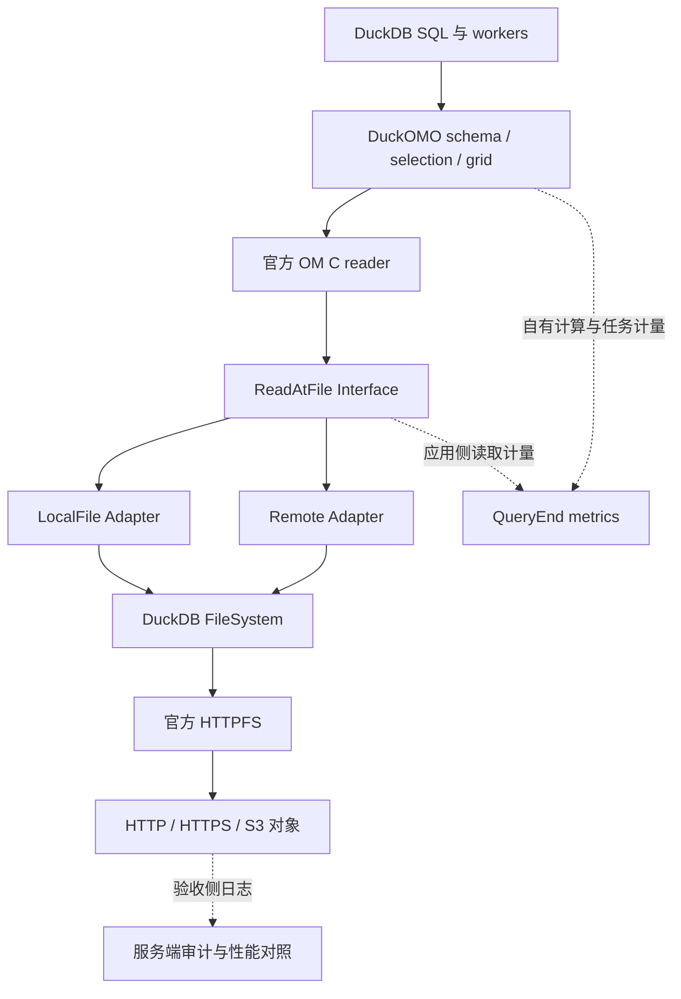

# DuckOMO 官方 HTTPFS 接入与职责收敛计划

日期：2026-10-08。状态：R01–R20 已执行；R21 独立复现待外部验证者。本轮版本范围经用户调整为 v1.5.4、v1.5.5、v1.5.6 / Linux AArch64。

本计划已获用户授权实施。现行契约已按第 4 节修订，旧失败记录保留。执行状态与证据记录在 [官方 HTTPFS 迁移证据](../../specs/004-multi-grid-selection/evidence/official-httpfs-refactor/)。

## 1. 目标与范围

建议最终运行路径：官方 DuckDB + 对应版本、平台的官方 HTTPFS + DuckOMO 扩展。DuckOMO 发布自己的扩展产物，远程用户按 DuckDB 的标准方式安装和加载 HTTPFS。

本轮保留 OM 格式支持、官方 OM C 解码、变量与轴语义、坐标计算、候选选择、完整 WHERE、DuckDB 并行调度、任务覆盖及查询终态。重构集中在远程 I/O、自有范围缓存、传输观测、构建和相关验收。

不在本轮扩展到新格式、新网格、多文件、写入、科学算子或新的通用后端框架；不把 `read_om.cpp`、全部 profiling 或 registry 顺便改写成另一套架构。

### 建议决策

| 决策 | 建议 | 原因与代价 |
| --- | --- | --- |
| D1 传输归属 | 使用官方 HTTPFS，移除项目自有 HTTPFS provider/observer ABI 与补丁构建 | 凭据、签名、HTTP/S3 协议、连接复用和重试交给已有实现；专用严格响应保证需要调整 |
| D2 缓存归属 | 本轮目标移除 DuckOMO 自有跨查询范围缓存，使用 DuckDB/HTTPFS 现有机制 | 自有缓存依赖版本、授权指纹、失效及容量账本；当前没有完整远程性能证据证明其维护成本值得保留 |
| D3 观测归属 | 运行时保留 DuckOMO 可直接测量的读取、解码、选择、任务和终态；网络性能证据由验收侧审计获取 | 标准文件接口没有当前专用响应事件；未知网络指标必须标未知 |
| D4 对象一致性 | 支持单次扫描期间稳定的对象；使用标准接口可取得的长度、版本标签检测可观察冲突 | 不承诺新增一套 HTTP 请求条件或全响应验证机制；官方已有 ETag 检查和可开启的 S3 版本固定，应复用并验证 |
| D5 接入接口 | 继续使用已有 `ReadAtFile`，减少其周围调用者需要了解的配置和生命周期 | 该接口已有本地、远程和内存测试实现；不需要另建网络客户端层 |

缓存移除是复杂度取舍，不是已经证明官方性能更好。实施时先取得对照数据；若代表工作负载出现不可接受的回退，再根据真实消费者和收益讨论一个独立、范围明确的后续缓存需求，不默认保留两套运行路径。

## 2. 当前事实与影响范围

本计划以当前工作树为基准，而不是只看 HEAD。HEAD 为 `4273a7dbe2b1897d83f77897ac71d99e382b0db1`；工作树包含大量 003/004 未提交变化，实施前必须冻结这些变化的源码身份，不能通过重置工作树取得所谓干净基线。

已确认：

- `ReadAtFile` 已隔开 OM reader 和实际文件读取。`OmV3Reader` 持有它，`LocalFile`、`RemoteReadFile` 和内存测试实现满足该接口。
- `OpenOmReadAt` 被 `ReadOmGlobalState` 和 `ReadOmLocalState` 使用；绑定另行创建 `RemoteReadSession`。因此绑定、global/local 生命周期都在影响范围内。
- `RequireHttpfsRangeCapability` 在远程 `Create` 和 `Open` 阶段运行。只换官方二进制、保留当前 DuckOMO 代码，会被明确拒绝。
- `RemoteFileOpener` 实现项目专用 provider；`RemoteHandleRangeSession` 实现请求策略、响应观察和版本检查。
- `RangeCache` 属于连接状态，默认 64 MiB，只缓存原始字节，不缓存解码结果。它同时牵涉 SQL 设置、清理函数、授权指纹和验证工具。
- 官方固定 HTTPFS 源码已有 Range 请求、ETag 一致性检查和 `s3_version_id_pinning`。官方版可以配合多个工作者的独立文件句柄并行读取，迁移不要求取消 DuckOMO 并行。
- 003 的远程 G3、G5/G6、远程 G4 和独立 G7 尚未完整通过。004 的完整远程与版本验收也未闭环；不能把本次方案描述为已验证可替代。

### 调用关系与动态消费者

```text
BindReadOm
  → RemoteReadSession::Create / Open
  → 当前 provider/capability/身份与缓存路径

ReadOmGlobalState / ReadOmLocalState
  → OpenOmReadAt
  → RemoteReadSession::Open 或 LocalFile::Open
  → ReadAtFile
  → OmV3Reader 的字节请求与解码

DuckomoExtension::Load
  → cache 设置回调 / GetClearCacheFunction
  → DuckomoSessionState::Cache

HTTPFS observer
  → ScanMetrics transport 字段
  → v4 / legacy_v3 / legacy_v2 与远程审计 harness
```

SQL 注册、设置回调、虚调用、构建变量和 JSON 字段都要用文本引用补查。GitNexus 的 LOW 风险或空调用列表不代表这些消费者不存在。

## 3. 目标职责与接口

| Module | Interface 与职责 |
| --- | --- |
| 官方 OM C reader | 格式、chunk/LUT、所需字节范围、压缩解码 |
| DuckOMO 扫描与网格 Module | SQL 参数、schema、逻辑选择、坐标、任务、DataChunk、完整 WHERE 的正确协作 |
| `ReadAtFile` Module | 长度、脱敏路径、受检位置读取及应用侧计量；成功返回必须满足 reader 请求的长度 |
| 本地/远程 Adapter | 通过 DuckDB 标准文件接口打开和读取；保留 ClientContext、文件访问限制与句柄生命周期 |
| 官方 HTTPFS | HTTP(S)/S3 传输、凭据发现、签名、端点/region、重试、连接与上游缓冲/缓存 |
| DuckOMO metrics Module | 自有逻辑请求、成功文件接口读取、解码、任务、内存范围和 QueryEnd 终态 |
| 验收工具 | 固定样本、完整结果对照、受控服务日志、传输收益与故障证据 |



### Interface 收敛

继续使用 `ReadAtFile` 这个已有 Seam。可将它从 `local_file.hpp` 移到拟新增的 `read_at_file.hpp`，保持类名和读取方法；这样 reader 无须因持有通用接口而引入本地路径处理。仅在统一受检读取逻辑确有重复时提取内部 helper，不增加多层 factory、manager 或通用 backend registry。

远程会话只保存本次对象 URI、脱敏路径、可取得的长度/版本证据和必要的共享状态。每个 worker 独立拥有文件句柄与 decoder。移除 `RangeCache*` 参数、provider/session vtable、逐 attempt 事件、授权 HMAC 分区和配套 capability 描述符。

远程打开继续携带 `ClientContextFileOpener` 或对应标准访问上下文，并遵守 `CanAccessFile`。不能用裸本地文件系统打开远程 URI，也不能借重构绕过权限限制。目录/glob/多对象限制和错误脱敏仍由 DuckOMO 维护。

标准 `GetFileSize` / `GetVersionTag` 可取得的证据用于 worker 打开时的可观察一致性比较。空版本标签不代表内容已验证；不能把官方文件句柄内部 S3 状态强制 cast 出来作为新的隐藏依赖。

## 4. 行为与验收契约调整

### 继续要求的结果

- 本地、HTTP(S)、S3 的固定同内容输入产生一致值、坐标、NULL、逻辑位置和结果多重集合。
- 局部选择覆盖全部匹配位置；完整 WHERE、变量依赖及 OM reader 的零值 index/data/decode 要求继续成立。
- 固定可跳块对象的冷局部查询实际远程响应数据量少于同列全扫，使用受控服务证据证明。
- 1/2/4 worker 无遗漏、无额外重复；任务少、LIMIT、取消、错误后恢复保持正确。
- 对短读、读取失败及可观察长度/版本冲突明确报错，不把失败结果或不完整扫描算成成功证据。
- 凭据、签名 URL、敏感头不进入产品日志、metrics 或错误消息。

### 建议删除或收敛的承诺

| 现行约定 | 目标约定 |
| --- | --- |
| 配套 ABI2/ABI3、engine/pair/build/header/patch 全字段 handshake | 使用 DuckDB 标准扩展版本/平台检查，记录实际加载产物；不再存在自有跨扩展指针协议 |
| 每查询必须新鲜 HEAD + 精确 `bytes=0-0`，缓存命中也执行 | 不承诺规定的 HTTP 请求序列，依赖官方文件打开与读取行为；明确上游缓存可能影响请求序列 |
| DuckOMO 检查每次 `206/Content-Range`、缺失 token、每次重定向和签名前条件 | 这些底层行为归官方 HTTPFS；保留标准接口能证明的检查，公开其能力和限制，不额外维护协议实现 |
| 自有跨查询缓存、清理、容量、热缓存严格收益 | 不提供 DuckOMO 自有 LRU；上游缓存不冒充相同容量、隔离或撤权语义 |
| 每 scan 精确响应 body、重试、状态与失败已收成本 | 运行时不可直接观测的字段为未知；验收侧保存服务端审计，不能把服务端已发送量冒充客户端已接收量 |
| OM 零值读取可以推导远端没有预取值字节 | 区分 reader 没有请求/解码值与 HTTPFS 实际缓冲、预取；远端额外传输单独审计 |

官方版不等于完全缺少响应检查，但上述强约定不能从普通 `FileSystem::Read` 成功自动推出。若实施前仍要求逐响应强校验、扫描快照或任意撤权立刻生效，需要先证明标准接口能兑现；不能只删断言或改验收期望让 gate 通过。

对于按需读取，先验证固定版本的 `force_download=false`、`force_download_threshold=0`、`auto_fallback_to_full_download=false`、`unsafe_disable_etag_checks=false` 及适用的 S3 version pinning。优先使用标准 opener 支持的局部设置机制；无法局部控制时明确列出会话前提，不在扫描中修改数据库全局设置。禁用全下载回退仍不等于取得专用响应 observer。

### SQL 与 metrics 兼容

`read_om`、`read_om_raw`、`om_grid_info`、`include_source` 的参数、输出类型及 `duckomo_max_threads` 保持现有语义。

建议移除的公开项是 `duckomo_cache_enabled`、`duckomo_cache_capacity` 和 `duckomo_clear_cache()`。在实施阶段调查真实消费者并明确发布版本和迁移说明；不保留默默无效的开关，也不让旧清理函数看起来能够清理官方缓存。如果已存在必须履行的兼容义务，单独制定有结束期限的弃用步骤。

本轮保留 v4 和现有 legacy 字段结构，聚焦含义真实，不顺便重写全部序列化。应用成功读取字节仍不代表网络或磁盘物理 I/O。

| 场景 | transport body / attempts / responses | 完整性与说明 |
| --- | --- | --- |
| 本地输入 | 已知为 0 | 本地没有 HTTP 传输 |
| 官方 HTTPFS 远程输入，无专用观测 | NULL | `complete=false`，明确未由 DuckOMO 观测 |
| 验收审计 | 保存于验收产物 | 独立注明服务端发送量、成功/失败及统计范围 |

特别注意：当前 `ScanMetrics::SetTransportAvailable(false)` 会写入已知 0 和 complete=true，不能拿它表示远程未知。实施时要明确区分“不适用”和“未观测”，同步更新 v4 及 legacy 视图。

自有 cache 被移除后，其 enabled/占用可报告 false/0，并标明原因；官方内部 cache 的命中与容量未知时不能报告成自有统计。`om_source` / `om_grid_info` 的版本证据和 `content_verified` 必须保持诚实，当前未验证字段不能因拿到一个 ETag 自动变成内容已验证。

这些变更须覆盖 003 FR-011/012/015–018、SC-003/004/006/007/008，004 继承的远程/计量/版本条款，以及 roadmap 的 C-09/C-11/C-12。C-10 的 DuckDB 并行调度职责继续保留。历史任务和证据按原契约保留，新验收另行记录，不覆盖旧结果或提前提升 roadmap 状态。

## 5. 实施顺序与任务

每个实施阶段按 Interface → Implementation → 调用者 → 测试及文档的顺序修改，阶段结束必须形成可构建、可评审的结果。复选框只按实际完成状态更新；独立复现不得由实现者替代。

### P0：冻结基线并落实目标契约

- [x] R01 记录当前工作树源码 hash、DuckDB/OM 版本、CLI/扩展产物和样本身份，保留 004 未提交工作；在隔离分支或副本中实施。
- [x] R02 按第 4 节修订现行契约、对应任务及 roadmap 决策。明确哪些是范围收敛、哪些是实现替换，不更改历史通过记录。
- [x] R03 调查上述 cache SQL 项和 metrics 字段的真实消费者，落实版本化移除/迁移说明。
- [x] R04 在删除旧路径前保存最小性能对照：同文件、同列、同连接寿命、同 worker 数，比较当前自有缓存关闭、当前缓存冷/热、官方目标路径。完整消费结果，记录耗时、服务端 body、请求、RSS 和上游缓存配置。

R04 的官方目标数据在 P1 可运行后补齐。性能阈值和代表样本在跑测前固定；不根据结果临时挑对象或宣称自有缓存没有价值。

主要文件：`specs/003-dimensions-remote-parallel/`、`specs/004-multi-grid-selection/contracts/`、`.specify/memory/roadmap.md`、`docs/spec.md`、`docs/roadmap.md`。

### P1：通过官方包完成最小接入

- [x] R05 保留 `ReadAtFile` Interface，厘清应用读取和 transport 未知的 metrics 状态；如需独立头文件，仅移动已有接口。
- [x] R06 实现通过标准 DuckDB 文件接口工作的远程 Adapter，携带当前访问上下文，保留边界检查、脱敏和句柄生命周期。
- [x] R07 将 `RemoteReadSession` 收敛为轻量对象状态，移除 provider/observer 与 capability 调用。同步更新 bind/global/local 调用者，不新增长期双后端开关。
- [x] R08 使用实际官方 DuckDB 与官方 HTTPFS 二进制运行本地、受控 HTTP、HTTPS 和带凭据 S3 的同内容纵向验证；不能只用本项目静态链接的 HTTPFS 证明官方包兼容。

主要文件：`src/include/duckomo/local_file.hpp`、`remote_file.hpp`、`src/om/local_file.cpp`、`remote_file.cpp`、`src/scan/read_om.cpp`、`src/include/duckomo/metrics.hpp`、相关 `test/CMakeLists.txt` 和接入测试。

退出条件：远程入口不再需要 `httpfs_om_range_capabilities()`，官方包可运行，缺依赖有清晰错误，远程未知统计没有伪装为 0。

### P2：移除自有缓存及连带职责

- [x] R09 移除 `DuckomoSessionState::Cache`、`RangeCache*` 传递、命中/插入路径和自有缓存的 SQL 注册。保留该连接状态的 metrics 发布职责。
- [x] R10 删除 LRU、access_partition、授权配置 HMAC 及其缓存失效代码。对象长度/版本证据若仍有实际消费者，将所需小数据结构放回读取模块，不保留缓存专用键字段。
- [x] R11 完成公开接口迁移，更新错误、示例、session metrics 和 SQL 测试。继续测试连接隔离、多个 scan、QueryEnd 和清理资源，不因删除 cache 测试而丢失查询终态覆盖。
- [x] R12 补齐 R04 官方路径对照，明确冷查询和重复查询的变化，以及网络/解码哪部分限制性能。

主要文件：`src/om/range_cache.cpp`、`src/include/duckomo/range_cache.hpp`、`src/om/remote_file.cpp`、`src/scan/read_om.cpp`、`src/include/duckomo/read_om.hpp`、`src/om_extension.cpp`、`test/native/range_cache_test.cpp`、`session_metrics_test.cpp`、`test/sql/cache_metrics.test`。

退出条件：生产路径无 DuckOMO 跨查询字节缓存，不存在无效兼容开关；性能取舍有数据和明确支持范围。

### P3：收敛构建、版本与发布

- [x] R13 移除 Makefile/CMake 中的 staged HTTPFS SOURCE_DIR、共享 ABI 头和配套编译定义，默认 release 构建不再构建或发布自有 HTTPFS。
- [x] R14 收敛 `scripts/version_matrix.py`、`build-version.sh`、`validate.sh` 及矩阵 manifest。保留引擎、OM、平台、编译选项和 DuckOMO 产物的可复现身份；实际 HTTPFS 版本/来源/hash 作为运行验证依赖记录。
- [x] R15 删除自有 patch staging、ABI2/ABI3 patchset、capability 和 provider 源码；确认无运行引用后更新 `.gitmodules`，移除项目自带的 HTTPFS gitlink。保留 DuckDB、OM 和现有构建工具依赖。
- [x] R16 替换 `grid_version_compat_test` 的自有 descriptor 检查为真实支持版本/平台的官方加载和结果验证。需要的新版本先确认官方 HTTPFS 产物可取得；没有官方产物的组合保持待验证，不静默回退自编版。
- [x] R17 更新用户安装文档：只发布 DuckOMO，使用 `INSTALL httpfs; LOAD httpfs;` 和 DuckDB 标准安装机制；保留 DuckOMO 未签名时相应加载前提。

主要文件：`CMakeLists.txt`、`Makefile`、`extension_config.cmake`、`scripts/stage-httpfs.sh`、`scripts/version_matrix.py`、`scripts/build-version.sh`、`scripts/validate.sh`、`src/include/duckomo/build_identity.hpp.in`、`third_party/httpfs-patches/`、`.gitmodules`、`README.md`、`README.en.md`。

默认发布记录无需复制官方 HTTPFS 的内部补丁管理。历史配套证据使用冻结版本引用保存，不让历史重现代码继续成为默认运行依赖。

### P4：替换验收依赖并完成发布证据

- [x] R18 将远程 harness 从专用 v3 body/capability/cache 断言改为新契约。复用已有受控服务、TLS 和审计代理，网络统计只留在测试工具；不建设新的运行时监控系统。
- [x] R19 替换专用 HTTPFS ABI 和 provider 单元测试，保留 DuckOMO 在标准文件 Interface 下的结果、短读、权限错误、取消和恢复测试。上游传输内部实现不再由 DuckOMO 重复单测。
- [x] R20 执行下面的验收映射，记录命令、退出码、官方产物身份、服务/fixture hash、未通过原因及性能对照。
- [ ] R21 由独立验证者按更新后的说明复现，最后同步发布范围与 roadmap 状态；计划完成不等于实现或门禁通过。

主要文件：`test/native/httpfs_abi_test.cpp`、`httpfs_range_test.cpp`、`remote_session_test.cpp`、`grid_version_compat_test.cpp`、`scan_metrics_v3_test.cpp`、`scan_metrics_v4_test.cpp`、`test/tools/duckomo_remote_validation.cpp`、`duckomo_grid_validation.cpp`、`scripts/setup-remote-fixtures.py`、003/004 quickstart 和 validation contracts。

依赖顺序：P0 → P1 → P2 → P3 → P4。P1 的接入测试和受影响契约测试随该阶段完成，不积压到 P4 才发现官方包不能使用。R04/R12 的结果可以阻止发布或触发明确的范围重审，但不自动触发重建自有网络栈。

## 6. 验收映射与证据口径

| 当前验收 | 迁移后处理 |
| --- | --- |
| 003 G0–G2，本地 schema/轴/筛选/零值读取 | 结果标准沿用，跑受影响回归；历史结果仍只证明历史版本 |
| 003 G3，跨源一致性与故障 | 对实际官方包重跑本地/HTTP/HTTPS/S3；删除专用 capability 要求，按新契约区分底层协议保证 |
| 003 G4，串/并行 | 并行要求保留；远程 1/2/4 worker 多重集合、覆盖、耗时与 RSS 重跑 |
| 003 G5，自有缓存 | 原 G5 标为目标契约已替换，保留历史状态；以官方路径冷/重复查询、稳定对象和访问变化测试替代，不再断言 DuckOMO hits/eviction |
| 003 G6，统计/失败/取消 | 保留终态和连接/scan 隔离；运行时未知字段验证与验收侧服务记录分开 |
| 003 G7，独立复现 | 使用新的安装、并行和网络证据流程重新执行 |
| 004 H3，零值读取 | reader 的 value index/data/decode=0 保留；网络预取不得由这些计数推断，需要独立审计 |
| 004 H4/H5，生命周期与内存 | 远程取消/恢复重跑；移除自有 transport/cache 分配后更新自有账本，上游 HTTPFS 内存仍单独说明，不能宣称总内存已被约束 |
| 004 H6，跨源与真实收益 | 继续要求每类固定真实对象结果一致、冷局部 body 下降；使用独立服务记录，不依赖产品 observer |
| 004 H8/H9，版本与交付 | 以官方加载产物和同套验证集证明；取消自有 ABI handshake，保留版本/平台及独立复现要求 |

成功并完整消费的性能查询，可用服务端 body 和请求日志进行对照。失败/取消时服务端已发送量与客户端已消费量不一定相等，分别标注范围，不能从二者不相等直接推断产品漏计或强行补造客户端统计。

只有修改预先记录的契约才可替换旧 gate；不能直接删掉失败断言后沿用原 gate 名称宣称原保证通过。

## 7. 完成条件与风险

实施完成的可检查条件：

- 默认源码、构建和运行不依赖 `HTTPFSOm*`、`httpfs_om_range_capabilities`、自有 patch/header digest 或 staged HTTPFS。
- 默认安装和发布只包含 DuckOMO 产物，远程读取使用实际官方 HTTPFS。
- 自有 `RangeCache`、授权指纹及缓存 SQL 项按公布的迁移方案退出；没有长期双实现或无效开关。
- reader/selection/grid 不需要了解 HTTP 状态、签名、重试或 HTTPFS 私有类型；每 worker 句柄独立。
- 可量测的应用指标与不可量测的 transport 字段明确区分，remote NULL 和 local 0 都有契约测试。
- 核心本地结果、官方远程同内容结果、按需读取收益和远程并行完成对应新验收；重复查询性能变化有记录。
- 当前规格、任务、README、架构和 roadmap 对能力范围一致；历史证据保留原范围和状态。

主要风险与处理：

1. **官方包兼容尚未实测。** P1 必须用实际二进制纵向验证，不能从同版本源码推定兼容。
2. **协议保证与缓存接口是公开行为变化。** P0 明确目标契约与迁移版本，避免用“内部重构”掩盖差异。
3. **缓存性能收益未知。** 删除前保存代表性基线，独立报告冷查询与重复查询，避免把筛选收益归因缓存。
4. **官方缓存可能影响版本/授权与冷测。** 记录上游配置与状态，重跑访问变化；公开符合标准依赖行为的支持范围，不承诺已经移除的每查询强授权探测。
5. **当前工作树包含在途 004 工作。** 基于冻结工作树实施，保留已有编辑，不顺带移除新网格或未闭环任务。

## 8. GitNexus 分析记录与局限

仓库没有既有 GitNexus 索引。本次复制 167 个项目源码/脚本/测试/补丁文件到临时目录，以 `--index-only --skip-git` 建立索引，并通过 `GITNEXUS_HOME` 将注册和索引状态隔离在临时目录。没有向原仓库写入 AGENTS、CLAUDE 或索引配置。

索引报告：4,358 nodes、14,053 edges、276 flows。没有纳入全部 DuckDB/HTTPFS/OM 上游源码、样本数据和历史 evidence；这些依赖的行为另行按固定源码和现行契约核对。

按技能顺序执行了 upstream impact、执行流程 query 和 symbol context：

| 查询 | 图结果及源码补查 |
| --- | --- |
| impact `RequireHttpfsRangeCapability` | 直接调用为远程 `Create`、`Open` |
| impact `OpenOmReadAt` | 直接调用为 `ReadOmGlobalState`、`ReadOmLocalState` |
| context `ReadAtFile` | 本地、远程、内存测试三个实现；`OmV3Reader.file_` 为持有者 |
| context `RemoteReadSession` | bind/global/local 和 ABI/version 测试依赖 |
| query cache 相关符号 | SQL 设置、清理注册、连接状态及 cache 测试都是消费者 |
| context `SetTransportAvailable` | 指标契约测试使用；源码另确认远程 `Create` 使用 |

图对 `cache_->Read`、部分 shared_ptr 成员调用、跨声明/实现和 SQL 注册引用有漏识别。例如 cache Read impact 返回 0，但源码中远程读路径实际调用它。因此图统计不作为删除安全的唯一证明，也不采用其 LOW 风险作为本计划总体风险判断。

实施时重新索引实施分支，结合实际 diff 使用 `detect_changes`；本次没有符号变更，未执行 rename 或重构测试。

### 核对入口

- [现行远程契约](../../specs/003-dimensions-remote-parallel/contracts/remote-io.md)
- [003 功能与成功标准](../../specs/003-dimensions-remote-parallel/spec.md)
- [003 历史验收状态](../../evidence/003-dimensions-remote-parallel/final.md)
- [004 选择与 I/O 契约](../../specs/004-multi-grid-selection/contracts/selection-and-io.md)
- [004 版本与门禁](../../specs/004-multi-grid-selection/contracts/validation-evidence.md)
- [项目约束与路线图](../../.specify/memory/roadmap.md)
- [现有 ReadAtFile Interface](../../src/include/duckomo/local_file.hpp)
- [远程 Implementation](../../src/om/remote_file.cpp)
- [扫描调用者](../../src/scan/read_om.cpp)
- [metrics 状态与序列化](../../src/include/duckomo/metrics.hpp)
- [当前配套补丁说明](../../third_party/httpfs-patches/README.md)
