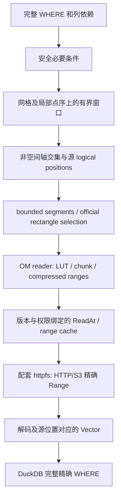

# Selection and I/O Contract

日期：2026-10-03；2026-10-06 按实现复核。该文件仍是选择/I/O 的验收约束；本地有界窗口、候选回退、官方 DecodeSelection 和 v4 selection 计量已有实现，完整内存 ledger、远程权限 epoch、ABI3 与 H2/H4/H5/H6 验收仍待完成。继承 [003 remote-io](../../003-dimensions-remote-parallel/contracts/remote-io.md)，实现不得弱化官方 reader、权限、版本、精确 Range 或零值读取。

## 包含性与边界

所有匹配 SQL 记录必须在候选中；候选允许多读。必要条件按输出坐标相同的函数、数值策略和 DOUBLE 比较求值，验证容差不参与用户筛选。投影/旋转逐点检查原生位置，因此曲线边界、域外四角、中部相交和接缝不依赖角点证明。对于不能分析的子树保留完整条件，扩大候选并记录有限枚举原因。

longitude 两区间的安全 OR 先形成 disjoint union，再筛选源位置；不能发重复窗口或让两分支各扫描同一源点。普通反向 BETWEEN 仍遵循 SQL。不支持分支不能仅丢弃该分支。Gaussian 在原始局部段内筛选，每个 local point 仅发一次；不能用 parent prefix 作为区域对象 offset。

## 惰性任务和 worker

1. bind 验证网格/轴/证据，复制安全谓词；optimizer callback 不做全域坐标扫描或保留过期 bound-expression 指针。
2. GlobalInit分别计算受检逻辑记录和任务数量上界。无有效空间过滤时按原始存储顺序分配≤65536条记录的任务，保持全扫读取/解码成本。空间过滤使用NativeWindow：坐标/count扫描沿最快空间轴，值扫描沿最后一个存储轴；`windows_upper=ceil(所选遍历轴长/65536)×其他轴选中位置数之积`。线程上限为引擎/连接配置与任务数上界的最小值。共享cursor在短mutex临界区领用不重叠descriptor，不在锁内预扫长空间线。
3. descriptor 固定其他轴并选取遍历轴的原生连续子线，窗口≤65536条记录。若最后一个存储轴为非空间轴，该窗口的地理坐标恒定，preflight只计算一次坐标并保留或排除整个窗口，使[point,time]和[y,x,time]的值读取沿time连续。任务生成不物化所有行、非空间组合或任务；position map 依真实 stride 计算，worker 内按原始 logical_index 有序。
4. worker 在发该窗口任何候选之前执行 preflight，最多保存 4096 ranges。超额丢弃该窗口选择并扩大到整个窗口，已完成其他窗口不受影响。没有可用地理条件直接 full interval，不能为构造单 interval 遍历全部坐标。Gaussian/规则单轴快路径可用受检行/区间界，但仍按输出数值边界核对。
5. 每最多 256 次坐标/映射求值及所有读/解码边界检查取消；descriptor 领用、轴区间构造、全域有效性验证也可取消。worker 独占 decoder，任一失败停止共享队列，QueryEnd 发布一次权威终态。
6. 候选 logical positions 经 bounded segments 转成官方矩形 selection。只解码输出和完整过滤依赖的变量；没有值依赖不创建值 decoder，不读值 LUT 来规划坐标/count 路径。

在不同非空间组合中可重复计算同一空间窗口，这是有界首版的 CPU 取舍。报告 coordinate_evaluations（包括重复），不为统计 unique points 新建全域 set。最坏选择 CPU 为 O(被考察逻辑记录数)，常见共享空间路径为 O(原生点数)；不宣称所有布局都只做一遍空间计算。

1/2/4为工作者上限，不保证极小任务启用全部线程；固定多任务样本必须证明实际并行且多重集合无遗漏/重复。无ORDER BY不保证结果顺序。精确candidate count在cursor exhausted且所有window preflight完成后可算，权威快照仅在最终成功完整扫描时发布；LIMIT/失败/取消为NULL+count_complete=false。observed_candidate_records是完成preflight的候选累计，scanner_rows仅是成功提交给DuckDB的记录，满足scanner_rows≤observed≤upper_bound。无地理条件且可由轴积确定的路径可提前报告exact，并注明解析来源。

## 内存预算

预算是实际 owned capacity 的上界，不只 vector.size。以下为新选择/扫描工作分配；原有持久定义/坐标输入与共享缓存独立报告，不能将工作 buffer 改名为定义。

| 组件 | 固定上界/计算方式 | 超限行为 |
| --- | --- | --- |
| 全局安全谓词+语义轴选择 payload | 1 MiB，含所有轴 intervals、复制的条件与索引；单轴不得仍无限累积 65536 段 | 超限在发任务前回退相关轴/条件全域，保留 WHERE |
| worker spatial selector payload | 256 KiB，包括≤4096 ranges 和坐标 scratch；不保存全域/整长线坐标 | 全未发窗口回退；只记录 reason 计数 |
| worker task source-position map | 65536×8=512 KiB | 切分 descriptor；禁止增长为全量任务表 |
| worker batch/segment maps | B≤STANDARD_VECTOR_SIZE（最大输出行数）；≤64 KiB映射控制payload | 分配前缩小batch或惰性逐段，不先物化整批再切分 |
| descriptor/stride/control | O(rank+变量数) 的固定数量实例，按绑定 shape 公布字节 | 绑定检查受检容量，不无限复制描述 |
| optional logical coalescing scratch | 每 active 值变量≤1 MiB，按需开启 | 分段或关闭合并，读取语义不变 |
| 官方 chunk decode scratch | Float32 基线 4×product(chunk_shape)，加官方状态实际分配 | 从元数据受检计算并公布；不能用 64 KiB 代替 |
| index/data read buffers | 根据官方 reader 本次请求上界；未读 LUT 前 Cmax 未知时用对象大小 F 作保守界 | 超出已公布/引擎可用预算明确资源错误；不为求界预读值 LUT |
| transport bookkeeping | 仅 active attempt/handle 的固定数量状态，受配套并发上限约束 | 不保存全查询 attempt ID 集合 |
| 共享范围缓存 | 沿用连接 duckomo_cache_capacity，默认 64 MiB | capacity 内淘汰，不增加预取 |

4×chunk_cells 并非全部 decoder 内存。buffer 合并目标 io_size_max=64 KiB 不是硬上界，单压缩块可能更大；data 容量界至少 max(64KiB,Cmax)。reader 当前替换 data_bytes 时旧 buffer 与新临时 buffer 可同时存在：实施须原位复用或将瞬时双 buffer 纳入峰值/上界。所有 index buffer、解码输出、状态、alignment 也须列入 bound ledger。

沿用OM rank 1–8限制；现BuildSelectedBatchSegments会先物化整batch的所有segment及rank向量，rank8的2048个碎片可约400KiB，必须改为预算感知builder/惰性分段，在分配前按64KiB容量界拆分，不能把旧builder原样接入后声称守住预算。

本次研究发现 metrics 当前保存全查询 transport_attempt_ids_ set，随请求数增长且未计峰值。实施须以活跃状态/单调 sequence 与单次终结 invariant 防重复计量，终结后释放；不能简单丢历史 ID 却允许晚到事件 double-count。累计 counters 固定容量，禁止保留每 line/point/attempt 的完整内存日志。

发布每个固定样本的 `query_bound = global_control + workers*(selector+task+batch+decoder+coalescing+control) + definitions + required_coordinate_inputs`，并单列引擎 output Vector/RSS 和共享 cache scope。input-dependent bound 在扫描前从 metadata/声明求出；值查询若解码块过大可以明确拒绝资源预算，坐标查询不受不存在的值 decoder 分配拖累。peak_unknown 不写成 0；失败/取消无法证明时 memory_complete=false。

SC-007 使用相同线程、缓存、chunk shape/最大物理块界与近似相同窄区域输出依赖；空间点数≥10×，上述 selection/scan work 峰值≤2×，含调度、统计控制和临时双 buffer。行表/必要输入及共享缓存另外实报，不能用豁免掩盖逐点空间索引。

## 逻辑段、压缩块与 Range

逻辑连续点不是固定字节偏移，不使用 point_index*sizeof(float)。多个片段可能落在同一块：真实重复读取/解码均计量。官方 DecodeSelection 一次处理矩形；必要时在同变量/受检源区域内做 bounded 逻辑矩形扩大与 position map，只复用官方 reader，不自行实现 LUT planner 或 decoded-block cache。

coalescing 必须分别报告额外解码输出、位置覆盖及预算，full/local 比较采用同一策略，不通过把全扫拆成大量重复块制造收益。存在巨大块/极碎片时允许无收益，只有事先固定可跳块样本通过严格下降后声明对应证据。

## 权限、版本及配套 provider

查询远程绑定保留新鲜授权与 HEAD/0-0 探测，即使 range cache 全命中。强对象 token、If-Match/VersionId 在签名前加入；精确 206、Content-Range、总长、body、identity encoding 验证完整。拒绝 200、短/多 body、412、强 token 丢失、不可证明安全的 redirect；不走 FullDownload/ReadAtWithFallback，不拼跨版本结果。

DuckOMO 现于每次绑定按对象路径读取适用的 secret 与 S3 endpoint/region/settings，使用每连接随机盐作 HMAC-SHA256 密钥计算 opaque access fingerprint；HTTP 还包括 `TYPE BEARER` 的 token、TLS 验证开关与自定义 CA 路径。fingerprint 改变时清除该对象旧 fingerprint 的缓存条目。worker 打开对象前会重新计算并与绑定身份比较，变化则要求重新绑定。凭据只参与进程内 MAC 输入，不进入身份 JSON、metrics 或错误消息；缓存仍不能代替新鲜授权探测。此实现尚未通过 T043 的变更/失效测试或签名 S3 撤权、恢复与切换门禁，不能据此声明远程权限范围已验证。

新组合使用 ABI3 capability handshake：engine full SHA、pair/build_id、httpfs commit、自有 patch/header digest、平台/C++ ABI 与 required_features。在使用跨扩展指针前核验并 fail closed；旧 003 ABI2 组合/证据原样保留，新 004 provider 不把旧 capability 冒充已满足 ABI3。

2.0 physical attempt observer 覆盖 core transport retry、S3 refresh/region retry、redirect 与取消已收 body，不只最终 HTTPResponse。若 core 隐藏重试不可观察，须最小显式 bridge 并记入版本组合。curl/httplib 仅经相同 protocol/cleanup gate 的 backend 可声明支持。

## metrics v4

外层 schema_version=4，完整旧 v3 口径保存在 legacy_v3（含 legacy_v2）；不将 v3 integer 静默改成 nullable。新增：

- grid：type/id/source、definition/coordinate rule、operation、绑定及坐标准备耗时/成本。
- selection：mode、exact_candidate_records nullable、observed_candidate_records、upper_bound_records、count_complete、coordinate_evaluations、windows/ranges/回退枚举累计；exact 不含未经匹配的上界。
- costs：metadata/coordinate/value_index/value_data logical 和实际读取；decode；所有物理 attempt response body；cache、task/worker 与耗时。
- memory：selector/global_selection/tasks/batches/definition/coordinate_input/decoder/coalescing/transport_control/shared_cache 的范围、容量界和峰值；总 query-owned 与完整性。
- outcome：权威终态、scan_complete、count/decode/transport/memory completeness；失败、提前停止和统计未知不能进入成功收益证据。

沿用 query/scan 隔离及脱敏。不要在 profile 保留完整点坐标、逐位置日志、secrets 或带签名 URI。服务端 sent body 与 client received body 在中止场景可以不同，须分别解释；成功收益测试应完整消费并按全部 attempts 对账。

## 2026-10-08 官方 HTTPFS 契约修订

当前未发布版本以 [官方 HTTPFS 迁移契约](../evidence/official-httpfs-refactor/contract.md) 为准。历史专用 ABI、LRU 与 G5 证据保留历史状态；新 gate 单独记录。
