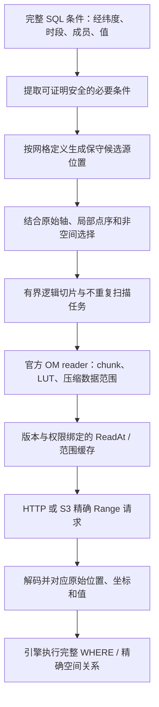

# Phase 6 规划输入：网格、远程 Range 与空间计算

日期：2026-10-02。本文是 `$speckit-specify` 的配套调研笔记，不是实施计划或运行验收。用户要求详细考虑经纬度范围如何传递到 S3 Range，以及后续空间计算和 DuckDB 2.0；[spec.md](spec.md) 固定行为与验收，本文记录事实和 plan 必须解决的工程选择。

## 1. 经纬度范围与文件字节范围之间的关系

“先将 lon/lat range 转成网格范围，再读取”适合作为入口，中间需要区分地理区域、网格/对象逻辑位置、压缩文件字节区间。地理矩形通常不对应一个网格矩形；网格连续位置也不意味着可计算出固定字节矩形。OM 物理块和压缩偏移由官方 reader 提供，不能套用 `offset = point_index * sizeof(float)`。

[现有架构](../../docs/architecture.md) 与 [003 读取契约](../003-dimensions-remote-parallel/contracts/remote-io.md) 已限定职责。应复用按需 ReadAt、权限/版本绑定、取消、实际 body 计量和缓存；网格扩展不需要自行实现 S3 签名、下载器或压缩块规划。

## 2. 已核对的代码约束

| 当前部分 | 已存在行为 | Phase 6 需要处理的问题 |
| --- | --- | --- |
| `src/grid/regular_grid.cpp` | 等间距规则经纬度 | 新网格的地理坐标未必能按两个一维轴独立生成 |
| `src/grid/spatial_layout.cpp` | 分离或展平轴，保留其他轴 | 原生 x/y、旋转坐标、Gaussian 行/点序和局部映射 |
| `src/scan/spatial_selection.cpp` | 独立 latitude/longitude 区间，候选数为两轴数量乘积 | 投影坐标相互关联，独立区间笛卡尔积不足以表示目标点集 |
| `src/scan/axis_selection.cpp` | 联合选择、惰性有界任务 | 相关空间片段与其他轴交集，避免全量点/任务清单 |
| `src/grid/domain_bbox.cpp` | 规则网格端点与 WKT BBOX 核对 | BBOX 不是投影参数或域覆盖证明，需定义可识别证据的校验范围 |
| `src/om/reader.cpp` | 官方 reader 请求物理索引和数据 | 延续逻辑选择入口，评估碎片导致的重复请求/解码 |
| `src/om/remote_file.cpp`、`range_cache.cpp` | 严格 Range、对象身份、精确/包含范围缓存 | 不能扩大预取绕开零值读取约束 |
| `scripts/build-version.sh` | 按精确 tag 独立构建及执行 SQL 集 | 尚非完整的配套 httpfs 版本矩阵，不能只凭可加载声明 2.0 兼容 |

003 的远程 G3/G5/G6 和独立复现 G7 尚未完整通过，见 [当前证据](../../evidence/003-dimensions-remote-parallel/final.md)。本地网格设计可以推进，完整远程门禁需先建立可靠的 003 基线。

## 3. 不同网格如何形成逻辑选择

### 3.1 规则经纬度

保留已验证的独立轴区间。接缝产生多个经度片段时，在源位置层求并集并消除重叠，避免同一点重复扫描。已有规则坐标计算和例外不应随着抽象调整被重新解释。

### 3.2 旋转与投影网格

`latitude(y,x)` 与 `longitude(y,x)` 通常相互依赖。一维“lat 轴 × lon 轴”模型不足以描述区域。可评估逐行 x 片段、保守 tile 范围与有界游标，再让完整 WHERE 精确过滤。

不能直接复用上游四角选框作为 SQL 候选证明：地理边界经变换可能弯曲，极值可能出现在边内部，四角在域外也不等于无交集。固定数量的边缘采样同样不能证明不漏点。plan 应对以下候选方案作有证据的选择：

- 具有解析界或保守误差界的变换范围与边界细化。
- 可证明包含全部地理点的 tile 摘要；摘要覆盖内部，不能只使用 tile 四角。
- 有界地遍历相关行/tile 的源坐标以求安全片段；计量准备时间并支持取消。
- 奇点、未知范围或预算超限时扩大候选或全扫，记录原因。

仅在坐标层遍历较多点仍可能减少值 I/O，但 CPU/准备成本必须公布，不能把省网络解释为恒定时间定位。FR-014/SC-007 限定工作内存，未要求所有网格具有相同定位复杂度。

### 3.3 Gaussian N 与区域子集

不等长行需要 `latitude[y]`、`row_count[y]`、行首位置及各行经度规则。按纬度选行，再按每行点数与经度规则选点；将普通区间或接缝并集转换为行内片段，再映射到文件 point 轴。

示意：行长 `[4,6,8]` 的缩小全域样本，其行首为 `[0,4,10,18]`；第 2 行内 `[1,3)` 对应全域点 `[5,7)`。原生区域对象若此前只截取部分点，其第 2 行首可能是 `3`；相同全域点还要依据该对象的行截取偏移转换。直接使用全域偏移会读错值。这只是位置示例，不是 N160/N320 的真实行表。

子集同一行可能发生经度环绕，文件点序要按来源确认，不能因经度规范化重排原始值。区域身份包含布局和行片段规则；不能明确局部映射时拒绝地理绑定。

### 3.4 与非空间轴相交

保留相关 x/y 片段或 point 片段，再与 time、member 等原始轴相交。把相关 x/y 片段拆成两个独立轴并集会扩大候选并使候选计数失真。元数据与 stride 决定切片形式，不能假定 time 总是最快轴。

候选点、逻辑段、任务和物理块可以有不同数量。同一块可能被多个片段命中；合并/调度可减少重复解码，但只能复用官方 reader 的能力，不能另做压缩格式实现。评估要报告请求、解码和实际 body，完整 WHERE 始终保留。

## 4. 固定上游发现与坐标来源

本次 Open-Meteo 来源固定为现有 registry 使用的提交 `b06f4760fd1f997e5559bb380f64c5e496b4a509`，不据此宣称新 domain 已验收。

| 来源 | 已核对事实 | 对规格/计划的影响 |
| --- | --- | --- |
| [ProjectionGrid.swift](https://github.com/open-meteo/open-meteo/blob/b06f4760fd1f997e5559bb380f64c5e496b4a509/Sources/App/Domains/ProjectionGrid.swift) | 原点与 dx/dy 决定原生坐标，inverse 生成地理坐标；`findBox` 使用四角 | 可作独立坐标来源；其选框不构成 SQL 不漏点保证 |
| [LambertConformalConic.swift](https://github.com/open-meteo/open-meteo/blob/b06f4760fd1f997e5559bb380f64c5e496b4a509/Sources/App/Domains/LambertConformalConic.swift) | 球面模型、原点、两条标准纬线和显式半径；处理纬线重合 | 同名投影不足以确认参数，不默认 WGS84 椭球或统一半径 |
| [Stereographic.swift](https://github.com/open-meteo/open-meteo/blob/b06f4760fd1f997e5559bb380f64c5e496b4a509/Sources/App/Domains/Stereographic.swift) | 显式半径与中心；inverse 包含除以距原点长度的计算 | 中心处需定义有限极限，不能直接复制未定义参考结果 |
| [GemDomain.swift](https://github.com/open-meteo/open-meteo/blob/b06f4760fd1f997e5559bb380f64c5e496b4a509/Sources/App/Gem/GemDomain.swift) | regional 使用 stereographic；rdps/hrdps 旋转网格有不同极点、原点语义和方向 | 明确北/南极约定、轴方向与原点，不能靠 shape 泛化 |
| [ChmiDomain.swift](https://github.com/open-meteo/open-meteo/blob/b06f4760fd1f997e5559bb380f64c5e496b4a509/Sources/App/Chmi/ChmiDomain.swift) | `aladin_cz_1km` 为规则网格，`aladin_central_europe_2km` 为 Lambert | 增加新条目，不能把既有规则 domain 重解释为投影 |
| [GaussianGrid.swift](https://github.com/open-meteo/open-meteo/blob/b06f4760fd1f997e5559bb380f64c5e496b4a509/Sources/App/Domains/GaussianGrid.swift) | N160/N320 使用不同查表；总点数分别为 138346/542080；也包含 O320/O1280 | 本期最低范围为 N，不能混淆 N/O 或以 N 编号猜测行表 |
| 同上 `getCoordinates` | 纬度采用 `dy=180/(2*N+0.5)` 的 Float 近似，不求 Legendre 根 | 生产者兼容和标准数学 Gaussian 纬度须有不同坐标规则身份，不能静默校正 |
| [GaussianGridArea.swift](https://github.com/open-meteo/open-meteo/blob/b06f4760fd1f997e5559bb380f64c5e496b4a509/Sources/App/Domains/GaussianGridArea.swift) | 根据区域 bounds、全域行号、行截取与局部前缀组织一维数组 | 独立局部映射不可省，WKT BBOX 不包含完整点序；plan 还要核对具体 N 子集对象 |
| [ECMWF Gaussian grids](https://confluence.ecmwf.int/display/OIFS/1+Gaussian+grids)、[Atlas Grid](https://sites.ecmwf.int/docs/atlas/design/grid/) | 标准纬度来自 Legendre 根；reduced 行在极区减少点数 | 可作数学/行结构交叉参考，不能覆盖原生近似语义 |

上游 Float 与本地 Double 结果可能不同，plan 须固定复现规则、来源级容差、独立参考和边界用例。验证容差与 WHERE 精确比较分开，不能将同一坐标结果同时宣称为生产者兼容和标准精确 Gaussian。

Registry 重生要固定全部参数/行表/区域映射输入及生成器版本，说明字段来自源代码还是实际对象。仅提取 nx/ny 与 BBOX 不够。投影库、自有公式或来源规则复现尚未选择。

## 5. 后续空间计算需要哪些信息

| 消费者 | 当前应保留的语义 | 后续独立设计的计算 |
| --- | --- | --- |
| 点与 polygon 关系 | 地理坐标来源、水平坐标顺序、源点身份、完整谓词 | 任意空间函数下推、空间连接候选规划 |
| `om_slice` | 原始网格、局部映射、切片来源/布局身份 | 返回形状和数据对象协议 |
| `om_reduce` | 点/单元含义、缺测、面积能力、维度单位 | 点统计与面积加权、守恒条件 |
| `om_interp` | 原生坐标、接缝、真实邻接能力、不等长行 | Gaussian 邻接、球面/投影距离、插值与缺测策略 |
| `om_regrid` | 源/目标定义身份、CRS、布局与单位 | 覆盖、插值或守恒算法、单元面积及误差保证 |
| 风场等向量分析 | 相对网格/地理方向的分量约定 | 局部向量旋转及未定义方向处理 |

扫描输出原生点值，扫描候选不是计算 stencil。插值可能需要区域外的邻点/halo，归约可能需要面积权重，regrid 的源支持范围不同于目标点范围。将来算子提出扩大源支持的需求后，应复用定义身份与逻辑选择，再经官方 reader 按需读取，避免算子各自实现远程 I/O。

空间功能调用方需明确 x=longitude、y=latitude，与 CRS 的形式轴顺序区分；变换工具若遵循 CRS 轴顺序，应显式处理。sphere 上的 native 角度不能仅附 EPSG:4326 标签就当作已验证 datum 转换；不能把经纬度角度的平面长度宣称为物理距离或面积。

plan 须选择用户可查询的描述和 opt-in 源位置形式，不在这里决定函数名、STRUCT 字段或强制几何列。默认 `SELECT *` 稳定，普通 `read_om` 继续输出原生 Vector。xtensor/xsimd、PROJ/GDAL、科学数据容器及 C/C++ 扩展 API 取舍均需基于实际需求决定。

## 6. DuckDB 2.0 兼容边界

官方资料包括 [2026-08-17 预览](https://duckdb.org/2026/08/17/duckdb-20-highlights)、[2026-09-02 预发布说明](https://duckdb.org/2026/09/02/try-duckdb-20-alpha) 与 [开发路线图](https://duckdb.org/roadmap)。本次还读取了 [预发布说明原始源](https://github.com/duckdb/duckdb-web/blob/main/_posts/2026-09-02-try-duckdb-20-alpha.md)：它说明 `v2.0-cyanoptera` 分支、核心扩展预发布，以及 community extension 的 `ref_next` 路径。预览涉及 parser、异步 I/O 和 API 变化；发布时间及最终接口不由预告推定，plan 开始时应重新确认精确 tag/commit。

[GEOMETRY 文档源](https://github.com/duckdb/duckdb-web/blob/main/docs/current/sql/data_types/geometry.md) 已包含 CRS 相关类型和操作说明，这提示 2.0 规划应核对实际固定版本的 CRS/轴顺序行为，不能依赖只生成裸几何的旧假设。文档 main 是滚动资料，本次没有据此验证任何具体 2.0 构建。

版本化构建不等于兼容。需逐版本核对：

- 参数绑定、新网格声明类型与 parser 对原查询的影响。
- 表/列绑定、表达式生命周期、完整 WHERE、projection/filter 依赖；不能保留失效表达式或漏掉残余条件。
- 任务/local state、取消/异常、重复位置、计数和 Vector 输出；先保证同步 Range 正确，2.0 支持不等于必须采用异步 I/O。
- ClientContext、opener、secret/授权、配套 httpfs capability、强版本与缓存分区；旧补丁 C++ ABI 不假定可直接复用。
- 实际 response body、重试/失败成本、QueryEnd 终态、内存范围与统计完整性。
- 空间类型/函数及 CRS 行为；不依赖未核对的预发布几何内部表示。

| 组合 | 本期规划目标 | 支持声明条件 |
| --- | --- | --- |
| 既有 1.5.4 基线 | 保留既有门禁和新网格行为，固定配套依赖 | 对应实际完整门禁 |
| 1.5.5 真实样本记录 | 保留原证据，是否扩大完整支持由 plan 列明 | 旧样本通过只代表该范围 |
| 固定 2.0 dev/alpha/beta/RC 或提交 | 尽早完成相同正确性、远程和生命周期验收 | 仅声明该预发布组合通过 |
| 固定 2.0 正式版 | 可用后单独构建并重新验收 | 正式完整门禁通过后声明正式支持 |

区分网格数学、逻辑选择和引擎表达式/文件系统边界，有助于跨版本复用相同规则；模块划分和 C API 取舍由 plan 决定。保留现有 C++17 基线，不根据大版本号推定必须整体重写。

## 7. plan 应形成的决策和证据

1. 四类定义及 N160/N320/区域子集的完整来源清单；每类真实对象、hash/版本、布局和独立参考路径。
2. 坐标规则版本、地球模型、精度和容差；标准与生产者 Gaussian 区分，projection WKT 的核对范围明确。
3. 相关 x/y 与 Gaussian point 片段如何表示、与其他轴相交、有界惰性执行；计数、并集去重和回退规则。
4. 投影候选的包含性证明、边界/奇点处理及碎片预算，不能用固定采样代替证明。
5. 是否需要源版本绑定的 tile/行摘要、CPU 成本和内存上界；新缓存必须有身份、容量、失效和计量。
6. 本地、HTTP(S)、S3 同列全扫/区域冷态证据，分别测选择、应用读取、解码与 body，并补齐所依赖的 003 门禁。
7. 网格描述与源位置契约、空间关系示例和未来能力状态；不提前宣称邻接、单元、面积或向量旋转已实现。
8. 1.5.x 与固定 2.0 预发布的配套构建/验收矩阵、正式版复验目标和 httpfs 补丁维护方式。

这些工程选择有合理候选路径，不是必须由用户现在回答的规格歧义；本次不生成 plan 或 tasks。

## 来源与取证范围

- 项目依据：[产品路线图](../../docs/roadmap.md)、[台账](../../.specify/memory/roadmap.md)、[接口](../../docs/spec.md)、[架构](../../docs/architecture.md)、001–003 specs 与 remote-io 契约。
- 上游 Swift 通过固定提交原始文件/源码归档读取；DuckDB 预发布与 GEOMETRY 通过官方文档仓库原始源读取。本文没有运行公式或新网格实现。
- 在线发现使用 `byted-web-search`；ECMWF 内容与 DuckDB 预览/路线图依据官方搜索摘要。DuckDB 站点正文直接请求被拒绝，部分内容经官方 GitHub 源补充；后续仍须核对固定版本源码/API。
- 本次未构建、运行实现测试、下载真实 OM 全量样本或执行远程比较；样本对照和读取收益均为待实施验收要求。
