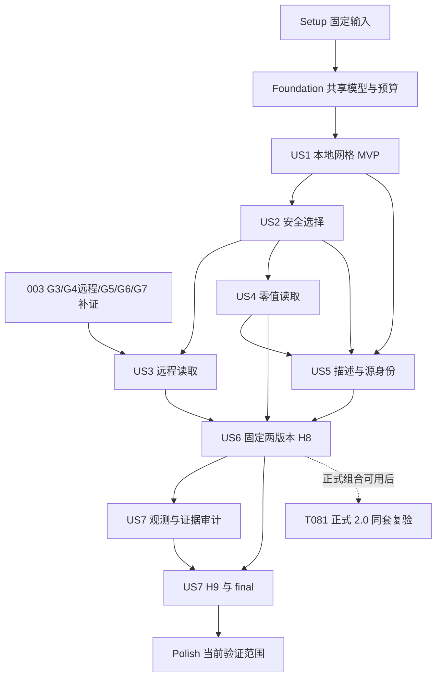

# Tasks: Phase 6 多类型网格与远程空间选择

**Input**: `specs/004-multi-grid-selection/` 中的 spec.md、plan.md、research.md、data-model.md、quickstart.md 和 contracts/ 三份契约。

**Prerequisites**: 复用 001–003 的单对象 OM v3 扫描器、官方 OM C reader、语义轴、Range、缓存和并行框架；constitution 仍为占位模板，治理依据为既有契约及 `.specify/memory/roadmap.md` 的 C-01–C-13。任务清单由规划生成；当前 checkbox 记录已完成的实现工作，不能单独视为 gate 验收或支持声明。

**当前执行范围（2026-10-10，替代 2026-10-08 暂缓决定）**: 负责人批准因缺少匹配 Open-Meteo 公开对象，本轮跳过 N160/N320/N 区域真实样本取得及依赖它们的真实验收，不阻塞当前范围收口；定义、身份和 native/synthetic 回归保留，不记为真实通过。按 [pinned producer 参考决定](contracts/pinned-producer-reference-20261010.md)（同日负责人批准：「可以认为一致，按照 Open-Meteo 自己的 Swift 项目就是这样的」），`ecmwf_ifs` O1280 与三个投影定义已登记 `coordinate-value-validated`；其基础是 2026-10-10 本地真实 domain/空间/抽样时间查询留证（evidence/baseline-local/o1280-real-local-20261010/final.md，含 HSURF 轴绑定修复）与匹配 baseline 的 H1 全量对照。远程收益、完整 gate 与 H9 仍开放。详见 [范围修订](contracts/gaussian-acceptance-20261010.md)，其优先于下文历史 N-grid 必选/supplemental 限制。T004、T028、T051、T055、T070、T080、T089 等未完成的非 N-grid 工作继续开放；checkbox/旧 gate 结果不因跳过自动关闭或改为通过，Phase 6 仍为 `in-progress`。

**Tests**: spec 明确要求独立坐标/官方值参考、SQL 差分、远程协议与成本、内存/取消、版本和独立复现，因此包含必要测试。各故事先建立契约测试，再实现并运行；生成本清单时不运行尚未实现的功能测试。

**Organization**: 按 spec 的 7 个故事、P1 → P2 顺序组织；共享模型及预算在基础阶段建立，公开 source/info 接口归 US5，公共观测模型在基础阶段建立并随各故事计量、由 US7 完成证据审计。依赖允许复用已完成的故事，不要求复制同一套 scanner。

## Format: `[ID] [P?] [Story] Description`

- 每项使用 `- [ ] Tnnn [P?] [USn?] 描述与精确路径`；只有用户故事阶段使用 `[USn]`。
- `[P]` 表示在其前置条件完成后可与不同文件的任务并行；具体配对和屏障见末尾，不表示可以跳过基础阶段。
- 所有路径相对仓库根；新增文件由任务创建。复用 `src/include/duckomo/metrics.hpp` 的现有实现，不新造不存在的 metrics.cpp。
- C++17/GNU C11，Linux AArch64；运行时不新增 PROJ/GDAL、Python/Swift、xtensor 或空间扩展依赖。

## Phase 1: Setup (固定输入与开发基线)

**Purpose**: 冻结来源、参考、样本和构建身份；不重新初始化已存在的工程。

- [X] T001 在 `specs/004-multi-grid-selection/evidence/initial-baseline.md` 记录现有构建身份及 001–003 本地 SQL/native 回归命令、退出码，引用 `evidence/003-dimensions-remote-parallel/final.md` 中未完成的远程/独立门禁；保留 1.5.5 有限真实样本记录，不把旧任务勾选视为验收。
- [X] T002 [P] 在 `test/data/grids/definitions.json` 和 `test/data/grids/source-manifest.json` 固定 Open-Meteo b06f4760fd1f997e5559bb380f64c5e496b4a509 的完整参数、源码 hash、f32 原点/运算规则、Gaussian 行表/区域段及 domain 轴 profile，并保存旧规则数学来源和 34b9cea169395be9b4686f2b5b23eca26dfef7a2 参考的不同身份。
- [X] T003 [P] 从可追溯归档或已授权来源取得四类真实原生 OM v3，在 `test/data/grids/sample-manifest.json` 冻结对象 hash/版本/大小、变量/轴/chunk 和可跳块性能样本；分别登记 N160、N320 与 N 区域的证据覆盖，缺失项保留 not-run，不伪造 URL 或把 v2 转换/合成对象标为真实。
- [ ] T004 在 `scripts/generate-grid-reference.py` 建立独立参考生成/导入入口，将固定源/独立数学坐标、GRIB/生产归档局部点序和官方 OM C 全量值解码的命令/输入/产物 hash 分别写入 `test/data/grids/coordinate-reference.json`、`test/data/grids/region-reference.json`、`test/data/grids/value-reference-manifest.json` 并补齐 T003；验收前冻结 f32≤1e-4°、double≤1e-8°或更严格阈值，禁止用待测坐标/选择内核生成 oracle。2026-10-08 按 pinned Open-Meteo commit `b06f4760fd1f997e5559bb380f64c5e496b4a509` 的 Float32 投影与 Gridable 运算增加 `pinned_producer_coordinates` 模式，source file hashes 和命令见 `evidence/development-local/pinned-f32-coordinate-refresh-20261008.md`，导入记录见 `evidence/reference-pinned-producer-f32-20261008.json`。三类现有投影 development CSV 共 2,843,101 点在冻结 `1e-4°` 内逐点通过，最大差异 `3.0517578125e-5°`；旧 binary64 独立数学诊断仍在近极点样本超限，归档记录保留但不用于 Float32 producer 一致性验收。2026-10-08 匹配 baseline build `5dac993fc31d45def31d02b87c7d23ced7858782fb9a6546b0e22e1a1b95f81d` 上的 H1 可用投影样本坐标/值子比较通过：2,843,101 个坐标位置满足冻结 `1e-4°`（最大误差 `3.0517578125e-5°`），329,401,680 个值位置按原始 `logical_index` 与官方 OM C Float32/NaN 参考精确一致。完整 H1 仍 not-run，因 Gaussian 目标对象/参考与独立 OM 轴到 producer 点序证明缺失；详情见 `evidence/baseline-local/h1-20261008-5dac993/`。按 logical_index 的 Lambert 全量值复核见 `evidence/development-local/h1-indexed-value-followup-20261007.md`。官方 ECMWF 文档另识别 ERA5 EDA N160、ERA5 HRES/AIFS ENS N320 为 GRIB 来源候选；所查 2025-07-01 AIFS ENS 公开镜像前缀只列出 `0p25` 文件、`n320` 子前缀为空。精确 native-grid 冻结对象尚未取得；Gaussian N160/N320/N320-region、Gaussian 区域点序和 GRIB/生产归档 region-reference 仍缺，故任务保持未完成。2026-10-08 官方文档调查确认 ERA5 Complete 可经需注册与许可的 CDS API/MARS 获取原生 HRES N320、EDA N160 GRIB，且 `grid=av` 保持归档网格；ECMWF 实时 Open Data 仅分发规则 0.25° 数据；固定 Open-Meteo b06f4760 的 ECMWF/AIFS forecast definitions 使用 0.25° RegularGrid，ERA5 ensemble 为 0.5° RegularGrid，ECMWF IFS analysis 为 O1280，也未提供要求的 N160/N320 OM v3 对象。该调查只提供 MARS 取数路线，未获取 GRIB/OM 对象或完成参考，T004 仍开放；详见 `evidence/development-local/t004-era5-native-grid-discovery-20261008.md`。 2026-10-08 user scope: count only existing Open-Meteo-published OM files and do not convert other source formats. The live S3 audit found no N160, full N320, or N320-region OM object; O320/O1280 remain distinct and are not substitutes. T004 remains open; see `evidence/baseline-local/open-meteo-s3-live-audit-20261006-1717z.md`. 2026-10-08 03:00 UTC read-only catalog metadata sweep: root listings were complete for 117 `data/` and 80 `data_spatial/` prefixes; 127/277 metadata reads returned 200, 10 returned 404, and 140 `data_spatial` latest/in-progress reads failed with URLError (collector exit 2). No N160/N320 metadata-label hits were found in readable responses. This is not object enumeration and the failed requests limit coverage; it adds no `.om` sample. Raw audit SHA-256 `d4ea465c0d02eb7f511eaacfb15327f4a4040a34201a65bf692150676d2777e8`; summary `evidence/baseline-local/open-meteo-s3-catalog-metadata-20261008-0300z.md`. 2026-10-10：本地真实 O1280 domain/空间/抽样时间查询已补留证并通过（冻结构建/SQL/逐 scan v4/官方值与 producer 坐标），T004 要求的独立原始 GRIB 扫描/点序到 OM 值参考仍未取得，任务保持开放。2026-10-08 03:07 UTC complete proxy-normalized catalog rescan supersedes the prior partial metadata scan: both root listings complete (117/80 prefixes), 277 reads yielded 267 HTTP 200, 10 HTTP 404, zero network errors; no N160/N320 metadata hits; O320/O1280 labels present; four exact AIFS Europe ensemble candidate prefixes each had zero objects and zero child prefixes. Reproduction: `python3 scripts/audit-openmeteo-s3-catalog.py --workers 4`; scanner SHA-256 `d343409cfd2261286921adb7bd80f77422d8d6540607a3a6e23b01191e82e3b6`; raw audit SHA-256 `19ed7e0b2d4c4a337d722ad778687039f02bd5be862fb778d300be7b1a074214`; summary `evidence/baseline-local/open-meteo-s3-catalog-metadata-20261008-proxy-normalized.md`. Catalog sweep does not enumerate all weather chunks; exact object scope remains covered by the linked live S3 audit. T004 remains open.
- [X] T005 在 `test/tools/duckomo_fixture_tool.cpp` 扩展合成样本生成，并把产物及 hash 登记到 `test/data/grids/sample-manifest.json`：反向/两种展平/交错空间轴、五类语义轴、多变量、极点/奇点、4096/4097 片段、超长线、四种网格各自≥10×点数且相同压缩 chunk 的内存对照；合成证据与真实证据分列。
- [X] T006 [P] 在 `test/data/grids/version-matrix.json` 固定 validation-evidence 契约的 baseline-1.5.4 与 prerelease-2.0-dev 全 SHA、OM/ci-tools、官方 overlay 顺序/hash、平台/compiler/options 和 ABI3 目标；两组合初始为 target，自有补丁/产物未产生时明确待实现，不填虚假 hash。

**Checkpoint（2026-10-10 修订）**: 定义输入可供本地开发。N160/N320/N 区域真实样本本轮经批准跳过，不再阻塞当前范围 H0/H1/H6；原冻结样本/结果保留历史身份，O1280 改为本轮 Gaussian 验收目标。T004 的 O1280/投影独立参考、真实点序及其他完整 gate 缺口继续开放；未完成目标或旧 gate 不标为通过。

---

## Phase 2: Foundational (共享模型、预算与执行入口)

**Purpose**: 所有故事共享的受检定义、身份、布局、观测和工具接口。

- [X] T007 在 `src/include/duckomo/grid_definition.hpp`、`src/include/duckomo/projected_grid.hpp` 和 `src/include/duckomo/gaussian_grid.hpp` 定义封闭 Regular/Rotated/Lambert/Stereographic/Gaussian variant、numeric_policy、earth/参数/单位及公共 native-position→coordinate 接口，禁止公共模型持有 DuckDB bound-expression 类型。
- [X] T008 在 `src/include/duckomo/grid_identity.hpp` 和 `src/grid/grid_identity.cpp` 实现 duckomo-grid-v1 的长度编码、固定字段顺序、binary64 位串/-0 规范化及 SHA-256，区分 grid/parent_grid/layout 身份并排除路径/domain/证据等级；在 `test/data/grids/canonical-vectors.json` 固定生成器与运行时共用 golden vectors。
- [X] T009 在 `src/include/duckomo/spatial_layout.hpp` 和 `src/grid/spatial_layout.cpp` 建立共享原始 shape/受检 strides、空间轴/非空间轴及 local/parent/logical position 映射接口，保留 legacy regular 适配；不以 shape、输出行号或经纬度去重决定位置。
- [X] T010 在 `src/include/duckomo/spatial_selection.hpp`、`src/include/duckomo/axis_selection.hpp` 和 `src/scan/axis_selection.cpp` 建立引擎无关必要谓词、NativeWindow descriptor 和受检轴选择，限制全局复制条件/轴 intervals payload≤1 MiB；分配前预算检查，超限扩大相关条件并保留 WHERE。
- [X] T011 在 `src/include/duckomo/metrics.hpp` 建立 schema_version=4 公共模型和完整 legacy_v3 快照（含 legacy_v2），分离 exact/null、observed、upper bound、坐标准备、各读取类别、memory scope 与终态完整性，提供各故事可调用的容量/峰值计量接口，未知量保持 NULL。
- [X] T012 在 `src/include/duckomo/reader.hpp`、`src/om/reader.cpp` 和 `src/include/duckomo/om_reader.hpp` 从元数据/声明计算 decoder、index/data/output/control 容量界及峰值；处理替换 buffer 的瞬时双份，未知 Cmax 时以对象 F 保守界且不为估界预读值 LUT，保留 io_size_max 为合并目标而非硬内存上限。
- [X] T013 在 `scripts/build-version.sh`、`scripts/stage-httpfs.sh`、`extension_config.cmake` 和 `CMakeLists.txt` 建立 `--matrix/--pair/--output-root` 的 manifest 驱动接口、隔离 source/worktree/stage 和生成 build identity 接口；保留旧 stable-tag 路径，缺补丁/不匹配输入明确失败，2.0 的可运行适配由 US6 完成。
- [X] T014 在 `test/tools/duckomo_grid_validation.cpp` 和 `test/tools/validation_support.hpp` 建立 quickstart 规定的 manifest/cases/duckdb/extension/httpfs/output CLI 与 gate 结果框架；在 `CMakeLists.txt`、`test/CMakeLists.txt`、`Makefile` 和 `scripts/validate.sh` 登记新模块/tool 及后续测试清单与 sanitizer 入口，未实现或缺输入的请求 gate 非零退出而非跳过后返回通过。

**Checkpoint**: 完成共享类型、身份、预算、观测模型和编译/工具接入后开始故事实现。真实对象 gate 与基础模型完成分别记录；矩阵骨架不等于版本构建通过。

---

## Phase 3: User Story 1 — 用同一地理坐标语义查询不同网格 (P1) 🎯 MVP

**Goal**: 完整显式声明或等价固定 domain 读取四类新网格，坐标/原始值/缺测正确，旧 schema 与规则行为不变。

**Independent Test**: 每类固定样本完整读取，native 映射逐源位置对照独立坐标/官方值，SQL 显式/domain 核对默认列和结果；覆盖 N160/N320/区域、反向/展平/交错轴及拒绝冲突。此故事不要求 US5 的公开 source/info；其身份 SQL 验收在 US5 补齐。

### Tests for User Story 1

- [X] T015 [P] [US1] 在 `test/native/projected_grid_test.cpp` 固定旋转 identity/180°源映射、f32 运算顺序、Lambert 单/双标准纬线/南半球、stereographic 中心极限/尺度及非法参数 vectors，对照独立 oracle 并检验有限坐标与归一化。
- [X] T016 [P] [US1] 在 `test/native/gaussian_grid_test.cpp` 覆盖 N160=138346/N320=542080、完整逐行 f32 纬度而非镜像、独立 Legendre roots/explicit 行参考和不同规则身份、行首尾/接缝、14747 点来源派生区域及独立实际局部点序，拒绝重叠/越界/缺映射/前缀溢出。
- [X] T017 [P] [US1] 在 `test/sql/multi_grid.test` 添加 version=1 的四类声明/domain 等价、legacy 七字段和无网格回归，以及未知/重复/缺失/NULL/有损整数、冲突 CRS/轴/列名、缺区域映射和未输出变量不相容的绑定拒绝测试。
- [X] T018 [P] [US1] 在 `test/tools/grid_registry_test.py` 和 `test/native/grid_identity_test.cpp` 检验 golden canonical vectors、两次生成一致、域名/来源注释不改变定义身份、参数/数值规则/布局/区域改变身份，以及区域 parent 身份的正确派生。

### Implementation for User Story 1

- [X] T019 [US1] 在 `scripts/generate-grid-registry.py` 实现固定 JSON→`src/include/duckomo/generated_grid_registry.hpp`，`--check` 临时生成两次并与 checked-in 定义/身份逐字节比较；更新 `src/include/duckomo/domain_registry.hpp` 和 `src/grid/domain_registry.cpp` 消费封闭定义、来源与 profile，保留全部旧名称及数学行为。
- [X] T020 [P] [US1] 在 `src/grid/projected_grid.cpp` 实现 rotated 的右手 basis、确定性极点 longitude=0 及两 numeric_policy；f32 路径按固定源 θ/ϕ、减 atan2 和 rotation=180 映射保留逐步舍入/先乘后除，结合 `CMakeLists.txt` 的数值编译选项防止不受控 FMA/重结合，不以 double 数学替代来源算术。
- [X] T021 [US1] 在 `src/grid/projected_grid.cpp` 实现球面 Lambert 逆变换、单标准纬线解析特例、双纬线/半球/原点/单位及 f32 来源路径，受检拒绝 n=0、极点标准纬线和无有限输出的退化参数（依赖 T020，同文件串行）。
- [X] T022 [US1] 在 `src/grid/projected_grid.cpp` 实现球面 stereographic 逆变换、ρ=0 解析中心、正 scale_factor 和源标准纬线尺度换算，覆盖极区/中心/奇点及两 numeric_policy（依赖 T021，同文件串行）。
- [X] T023 [P] [US1] 在 `src/grid/gaussian_grid.cpp` 实现显式 2N 行表、受检 row/region 前缀和、局部段定位、parent 映射、数值策略及经度归一化；支持完整和区域原始点序，禁止填矩形或依据 BBOX 重建局部偏移。
- [X] T024 [US1] 在 `src/grid/grid_definition.cpp`、`src/grid/spatial_layout.cpp` 和 `src/scan/read_om.cpp` 实现严格实际 STRUCT 校验、grid/domain 互斥/profile、separate/x_fastest/y_fastest/row_major、空间轴长度/顺序和全部变量轴身份校验，保留五类非空间语义及原声明/默认 schema。
- [X] T025 [US1] 在 `src/om/metadata.cpp`、`src/include/duckomo/metadata.hpp`、`src/grid/domain_bbox.cpp` 和 `src/scan/read_om.cpp` 保留并核对已识别 source CRS profile 的投影/earth/单位/关键参数及坐标证据；相关 CRS 未知或冲突时拒绝新地理绑定，Gaussian WGS84 来源按封闭字段核验，BBOX 仅诊断。
- [X] T026 [US1] 在 `src/grid/grid_definition.cpp` 和 `src/scan/read_om.cpp` 实现返回数据前的全域坐标有效性验证：优先解析参数域证明，不能证明时执行可取消、有界、零值读取的预遍历；每≤256次评估检查取消并计入准备成本。
- [X] T027 [US1] 在 `src/scan/projection.cpp`、`src/scan/batch.cpp` 和 `src/scan/read_om.cpp` 接入同一 native-position 坐标函数，支持地理坐标同时依赖两轴、反向/展平/交错轴及多变量逐位置值；输出有限 DOUBLE、保留缺测/语义类型与无关变量裁剪。
- [X] T028 [US1] 在 `test/tools/duckomo_grid_validation.cpp` 实现 H0/H1 的来源/生成/完整坐标/官方值对照、默认 schema 与显式/domain 核对，native 测试核对原始位置；真实缺失、容差未冻结或仅元数据样本不能通过相应范围，公开 source 部分留 US5 验收。H0/H1 runner fails closed on absent reference coverage; matched baseline H0 generation/binding/schema/identity subchecks passed, with paired matrix schema/source smoke results saved separately. 2026-10-08 matched baseline build `5dac993fc31d45def31d02b87c7d23ced7858782fb9a6546b0e22e1a1b95f81d` 的 H1 三类可用投影坐标/值子比较通过（2,843,101 个坐标点与 329,401,680 个值位置）；full H0/H1 remain not-run for missing Gaussian references and producer axis-order proof. See `evidence/baseline-local/h1-20261008-5dac993/`, `evidence/baseline-local/h0-query-regeneration-20261007-matched-schema/` and `evidence/version-matrix/schema-source-smoke-20261007.json`.
- [X] T029 [US1] 在 `test/CMakeLists.txt` 和 `scripts/validate.sh` 登记 T015–T018，运行新 native/SQL 与旧规则/纯值回归，并把完整命令、oracle/hash、缺失范围和退出码写入 `specs/004-multi-grid-selection/evidence/baseline-local/us1.md`。

**Checkpoint**: MVP 是四类本地完整读取与可信坐标，不包括远程收益、科学算子或正式 2.0 支持；缺任一真实类型不能声明四类已验收。

---

## Phase 4: User Story 2 — 将经纬度范围用于安全的区域选择 (P1)

**Goal**: 用保守原生窗口及完整 WHERE 实现单/双坐标、跨接缝并集和语义轴组合，正确缩小逻辑读取。

**Independent Test**: 四类完整物化基准后，局部查询双向 EXCEPT ALL=0；native 映射验证候选包含性与无重复，覆盖曲线/域外四角/nextafter/OR/片段超限/交错轴和值依赖，1/2/4 worker 多重集合一致。

### Tests for User Story 2

- [X] T030 [P] [US2] 在 `test/native/grid_selection_test.cpp` 检验投影曲线、中部相交而四角越界、极区/接缝、开闭/nextafter、Gaussian 局部片段、4096/4097 ranges 的完整窗口回退及候选包含性，不用坐标容差扩大 SQL 边界。
- [X] T031 [P] [US2] 在 `test/sql/grid_selection.test` 先物化完整基准再做双向 EXCEPT ALL，覆盖比较/BETWEEN/AND、两安全经度区间 OR、含不安全分支的完整回退、反向 BETWEEN、五类轴/不同输出与过滤变量、表达式/重复引用/计数/排序/聚合。
- [X] T032 [P] [US2] 在 `test/native/parallel_scan_test.cpp`、`test/native/axis_selection_test.cpp` 和 `test/native/spatial_lifecycle_test.cpp` 增加超长线/交错轴/跨 batch、[point=1,time=4] 窗口计线程、worker 锁外 preflight、预算/取消/失败恢复及 LIMIT 不完整候选计数测试。

### Implementation for User Story 2

- [X] T033 [US2] 在 `src/scan/spatial_filter.cpp`、`src/include/duckomo/spatial_filter.hpp` 和 `src/scan/read_om.cpp` 复制有限常量比较、BETWEEN、安全 AND 及至多两个完整安全经度区间并集；保留全部 engine WHERE/列依赖，不支持 OR 分支使整个 OR 扩大并记录原因，optimizer 不扫描网格。
- [X] T034 [US2] 在 `src/scan/spatial_selection.cpp` 和 `src/include/duckomo/spatial_selection.hpp` 实现原生存储最快空间轴的惰性 NativeWindow 游标及非空间组合交集，窗口≤65536 点，修复旧 BuildFlattenedPointRanges 的全量行片段物化；分别计算受检逻辑记录/窗口数上界。
- [X] T035 [US2] 在 `src/scan/read_om.cpp` 将 GetNextTask 改为短 mutex 仅领 descriptor、worker 锁外准备候选，按窗口数量与配置约束线程；独占 decoder、传播停止/取消和单次 QueryEnd，禁止预存全任务或锁内整线坐标遍历。
- [X] T036 [US2] 在 `src/scan/spatial_selection.cpp` 实现 projected/rotated 逐原生点和 Gaussian 局部行表选择，以与输出完全相同的坐标函数精确比较；selector≤256 KiB/4096 ranges，发出任何该窗口位置前超限整窗扩大，无地理条件直接 full interval，每≤256次评估检查取消。
- [X] T037 [US2] 在 `src/include/duckomo/batch.hpp`、`src/scan/batch.cpp` 和 `src/scan/read_om.cpp` 用真实 strides 构造≤65536×8字节 task position map 与预算感知逻辑 segments；batch≤STANDARD_VECTOR_SIZE，映射 payload≤64 KiB，分配前缩批/惰性分段，不能先物化 rank8 大缓冲再切。
- [X] T038 [US2] 在 `src/scan/read_om.cpp` 和 `src/om/reader.cpp` 把选中逻辑段映射为官方 DecodeSelection 的 read_offset/read_count 和输出 position map，仅解码输出/完整过滤依赖；支持空间轴不在末尾及 Gaussian local offsets，不自行规划 LUT/chunk/压缩字节位置。
- [ ] T039 [US2] 在 `test/tools/duckomo_grid_validation.cpp` profiling 固定全扫/局部的真实重复块解码；仅若首版不能达到预定可跳块样本的严格下降，在 `src/scan/batch.cpp` 和 `src/scan/read_om.cpp` 增加每 active 变量≤1 MiB 的逻辑矩形合并/取点，否则记录无需合并；两路径使用同一比较策略，禁止 decoded-block cache 或物理 planner。Lambert 的 105,763,320 个值按 logical_index 精确匹配；2026-10-08 三类投影的 pinned producer Float32 坐标参考与现有 development CSV 全点比较均在冻结阈值内；真实 OM array 轴映射、冷 full/local 重复块收益仍未验证。没有可信空间映射可用于真实 full/local 剖析，不作合并结论。 2026-10-08 the prior `/tmp/duckomo-t039-probe` outputs stopped changing and no writer was found, but no successful exit/result or usable complete metrics were captured; this attempt is not evidence and T039 remains open. Do not restart the full scan without a validated real spatial mapping.
- [X] T040 [US2] 在 `src/scan/read_om.cpp` 接入 v4 的窗口/ranges/回退/重复 coordinate_evaluations、observed/upper/exact 与 worker/task 计量；exact 只有游标 exhausted 且全部 preflight 完成后可算、最终成功完整扫描才权威发布，LIMIT/失败/取消为 NULL，纯轴积例外注明解析来源。
- [X] T041 [US2] 在 `test/tools/duckomo_grid_validation.cpp` 实现 H2/H4 与 H5 本地部分：完整物化差分、多任务实际 active workers、生命周期及四类≥10×空间点数/相同 chunk/线程/cache/相近窄结果的 work peak≤2×和逐项上界，准备阶段取消也进入验证；只实现本地子 gate，运行/证据留 T042。
- [X] T042 [US2] 在 `test/CMakeLists.txt` 和 `scripts/validate.sh` 登记 T030–T032 并运行本地选择/并行/内存及旧回归，保存 `specs/004-multi-grid-selection/evidence/baseline-local/us2.md`；H5 的远程 bookkeeping 部分在 US3 补齐，缺项不记完整 H5 pass。

**Checkpoint**: 区域查询精确且本地逻辑读取可缩小；选择 CPU 成本包含非空间布局重复评估，候选数和结果行数分别报告。

---

## Phase 5: User Story 3 — 在 S3 和 HTTP 上真正减少局部读取 (P1)

**Goal**: 四类网格的同内容本地/HTTP(S)/S3 查询一致，局部实际 body/值字节/解码严格下降，继承严格授权/版本/Range。

**Independent Test**: 冻结可跳块样本，关闭并清空各内容缓存，完整消费同列 full/local；三类来源按原始位置/坐标/值/缺测核对，受控 HTTP、实际 TLS 和签名 S3 逐 attempt 服务端/客户端对账，故障后有效查询恢复。

### Tests for User Story 3

- [X] T043 [P] [US3] 在 `test/native/remote_session_test.cpp`、`test/native/range_cache_test.cpp` 和 `test/native/httpfs_abi_test.cpp` 增加权限配置 fingerprint/epoch 变更、访问分区失效、新鲜授权、ABI3 pair/header/patch/engine 不匹配的 fail-closed 测试，保留旧 ABI2 历史组合检查；实现已覆盖，执行留待 T055/T093 验证。
- [X] T044 [P] [US3] 在 `test/tools/duckomo_remote_validation.cpp` 和 `test/native/httpfs_range_test.cpp` 建立 403/404/无HEAD/200/错Range/短多body/非identity/token丢失/412/替换/timeout/cancel/redirect 及所有 retry body 的协议断言，包含缓存 cold/hot/disabled/clear/eviction 和真实签名 S3 撤权/恢复/secret/endpoint/region 切换。完整HTTP/S3执行与服务审计留 T055。

### Implementation for User Story 3

- [X] T045 [US3] 在 `third_party/httpfs-patches/httpfs_om_range_v3.hpp`、`third_party/httpfs-patches/baseline-1.5.4/manifest.json` 及该目录独立 patchset 建立 ABI3：engine/full pair/build_id/httpfs/patch/header/platform/C++ABI/required_features 核验；在 `src/om/remote_file.cpp` 使用跨扩展指针前拒绝 stock/不配套 provider，旧 ABI2 文件与证据不被重写。
- [X] T046 [US3] 在 `src/om/remote_file.cpp`、`src/include/duckomo/remote_file.hpp`、`src/om/range_cache.cpp` 和 `src/include/duckomo/range_cache.hpp` 每次新绑定按当前授权/secret/endpoint/region 求会话盐化 opaque fingerprint/epoch，配置变化失效相关分区；仍执行新鲜 HEAD/0-0/worker 身份检查，不泄露凭据或以 cache 命中代替授权。
- [X] T047 [US3] 在 `src/include/duckomo/metrics.hpp` 和 `third_party/httpfs-patches/0001-om-range-session.patch` 移除全查询 transport_attempt_ids_ 集合，采用有界 active 状态/单调 sequence/一次终结 invariant；覆盖 retry/取消全部已收 body，阻止晚到重复计量并释放终结控制状态。
- [X] T048 [US3] 在 `scripts/setup-remote-fixtures.py` 增加 `--grid-manifest/--s3-service-version/--http-tls-cert/--http-tls-key`、全部固定对象上传和逐 attempt HTTP/HTTPS/S3 审计；固定服务版本/digest，生成 run.env/secret SQL 为仅当前用户可读，仅使用已授权测试桶并脱敏日志。
- [ ] T049 [US3] 在 `test/tools/duckomo_remote_validation.cpp` 和 `scripts/validate.sh` 用明确配套的基线执行 003 G3/G5/G6 与完整远程 G4，补齐 body/权限/cache/取消/并行隔离证据到 `evidence/003-dimensions-remote-parallel/`；记录本次 ABI3/v4 与旧 ABI2/v3 的范围，缺服务或失败不得勾选旧未完成任务。 2026-10-08 failed-response body 计数修复已验证：ignore-Range 从 client/server 1/481 修正为 481/481；小型拒绝/重试正文按实际 callback 计数，超大/未知长度正文限流并标记 incomplete，预发布 CURL/httplib 保留限流内 S3 XML 错误供原生重试。诊断 G3/G4 pass；G5 的 false JSON、淘汰 fixture、query 内命中判定、预期 CLI exit、secret SQL 写法和 bail 模式已修正，但 signing-region 拒绝检查仍 fail；独立 G6 取消/并发诊断 pass（修复取消后 SIGPIPE），不替代完整组合 gate。因此保持未勾选，证据见 `evidence/003-dimensions-remote-parallel/20261008-body-accounting-repair/`。
  2026-10-08 受控 SeaweedFS 4.48 本地服务中复现并修复 S3 审计代理的临时端口耗尽：跨客户端复用最多 16 条上游连接，并在复用前丢弃已关闭的空闲连接；7 项 subprocess 回归通过。最终配套 baseline 真实 OM 冷 S3 全扫完成 226,418 次请求且无代理错误，88,261,923-byte CSV 与本地/HTTP 完全一致，客户端与完整代理审计均为 196,376,420 body bytes。完整 harness 随后在 HTTP ignore-Range 故障的成本对账失败（服务端发送 481 bytes，客户端 profile 计 1 byte；响应头阶段拒绝 200 先于 body 回调），native exit 1；G3 保持 fail，G4–G6/full H6 保持 not-run。失败协议场景的实际接收计量与服务端发送量核验仍需补齐，不用 Content-Length 代替实际收到字节。完整修复前后审计、source/artifact hashes 和失败记录见 `evidence/baseline-remote/controlled-local-20261008/502-repair/README.md`，T049 不勾选。
- [ ] T050 [US3] 由未参与 003 实现的执行者按 `specs/003-dimensions-remote-parallel/quickstart.md` 完成 G7，保存真实命令、环境、退出码和结论到 `evidence/003-dimensions-remote-parallel/quickstart-review.md`；H6/H8 的 003 依赖未闭环时保持待验收，不用实现者自测代替。
- [ ] T051 [US3] 在 `test/tools/duckomo_grid_validation.cpp` 实现 H6 的同内容 local/HTTP/HTTPS/S3 对照，包含非连续窗口、空间轴不在末尾、时段交集和 Gaussian 区域 local offsets；按对象内容和原始逻辑/局部/父位置核对，来源 URI 的 opaque object_id 分别核验而非强求相等。2026-10-07 在 `test/native/remote_session_test.cpp` 增加 interleaved synthetic local/loopback-HTTP 子检查：覆盖两个不连续经度窗口、valid_time 交集、非末尾空间轴及 grid/layout/logical/point/axis 身份；按 URI 分别确认 object_id 非空，不要求相等。`remote_session_test` 退出 0；HTTPS、S3、Gaussian region 和真实样本比较仍未实现/运行，T051 保持开放。H6 runner 现保存 local/HTTP 结果 CSV、两端 v4 metrics、非空 object-id 断言及逐查询 loopback 服务端 body-byte 对账；见 `evidence/baseline-local/h6-loopback-20261007-final/`。2026-10-08 runner 另校验 local/HTTP v4 的 `memory.query_owned_released_at_terminal`；复跑 64 行完全匹配、服务端与 HTTP metrics 均为 3,270 bytes，local 合成子检查通过、完整 gate 为 not-run（exit 2），manifest audit 通过，见 `evidence/baseline-local/h6-loopback-20261008/`。合成子检查不替代四类真实样本与受控 HTTPS/S3。
- [ ] T052 [US3] 在 `test/tools/duckomo_grid_validation.cpp` 实现四类事先固定样本的 cold 同列 full/local 完整消费与严格下降门禁，计入 bind/HEAD/探测/坐标准备/全部 retries 的总已收 body、值 data 和 decoded blocks，并用服务端审计独立对账；失败/LIMIT/未知统计不得计收益。
- [ ] T053 [US3] 在 `test/tools/duckomo_grid_validation.cpp` 接入 T044 的 H6 故障、强弱版本、同 URI 等长替换、授权配置/cache 与错误后恢复集；确认禁止 FullDownload/ReadAtWithFallback、半段缓存和成功返回跨版本/残缺结果。2026-10-08 H6 loopback 子检查新增弱 ETag 跨查询 cache miss、同 URI 等长强 ETag 替换（新结果逐行匹配 replacement fixture，122 response bytes 与服务端一致）、短读失败后同 URI 完整结果恢复及 un-ranged GET fallback 计数；remote_session_test 与 runner protocol jq 校验通过，证据见 `evidence/baseline-local/h6-loopback-protocol-final-20261008/h6-local/protocol-cache.json`。T053 仍开放：受控 HTTP/HTTPS/S3、S3 授权配置变化和完整 T044 远程矩阵尚未执行。
- [X] T054 [US3] 在 `test/tools/duckomo_grid_validation.cpp` 补齐 H5 大量远程 attempts、reader 瞬时 buffer 及 observer/handle 取消释放验证，核对 query-owned bound ledger 和 transport_control 峰值不随历史请求数增长，不以 RSS 或改名为定义规避工作缓冲比较。2026-10-07 `remote_session_test` 新增 multi-chunk synthetic Gaussian HTTP stress：6 次完整冷扫描累计至少 256 transport attempts；每次 QueryEnd v4 body 与 loopback 收到字节一致，query-owned 与 transport_control 峰值均在 bound 内，transport_control peak 不随此前完成请求增长。H6 runner 将逐次 attempts、服务端 body 和两类内存峰值/bound 写入 `h6-local/attempt-stress.json`。2026-10-08 六次复跑共 3,462 attempts；每次 query-owned peak 1,800,918/2,584,092 bytes，transport-control peak 稳定为 38,404/38,800 bytes，取消查询断言 status=cancelled 且 QueryEnd 时所有 query-owned accounts 已释放。`reader_capacity_test` 增加失败扩容用例：初始 64-byte buffer 后请求 `size_t` 最大长度，分配失败并断言旧数据指针/容量/尺寸均已清零；构建及 native 用例退出 0。最新 H5 本地刷新 `evidence/baseline-local/h5-local-refresh-20261008-t054-closed/` 的五类 local check 与 14 条命令全部通过，manifest audit 通过；四类 work-peak 比值为 1.000223/1.000223/1.000223/1.000214，结果行数保持 1/1/1/3。T054 的实现和本地 synthetic 验证完成；完整 H5 runner 因 HTTP/HTTPS/S3 输入均缺失而以 exit 2 记录 `not-run`，受控 baseline-remote H5 与 server JSONL 仍由 T055 覆盖，不据此声明 H5 gate 通过。
- [ ] T055 [US3] 在 `test/CMakeLists.txt` 和 `scripts/validate.sh` 接入远程工具/协议测试并执行基线 H6 与完整 H5，保存 `specs/004-multi-grid-selection/evidence/baseline-remote/` 的 manifest/metrics/服务端 JSONL/结果 hash/退出码；未满足 T003/T004/T049/T050 时明确缺口，公开 source SQL 交叉核对由 T070 补齐。2026-10-07 将 grid-validation 的 `--server-log` 前置校验改为匹配 setup 脚本导出的日志目录（要求 `http.jsonl` 与 `s3.jsonl`），CLI self-check 通过；随后接入仅在受控 HTTPS 配置存在时运行的 H5/H6 harness 入口，并验证无服务时保存 synthetic local/loopback partial evidence、full gate=`not-run` 及退出码 2。2026-10-08 CLI self-check 通过，H6 本地/loopback partial run exit 2 且 manifest audit 通过，证据见 `evidence/baseline-local/h6-loopback-20261008/`。受控 H6/H5 runner 执行、server JSONL 和完整远程证据仍未完成。

**Checkpoint**: 远程收益以成功且完整的真实传输成本证明。公开 HTTPS 冒烟、元数据绑定或本地 gate 不替代签名 S3/受控 TLS/003 依赖。

---

## Phase 6: User Story 4 — 只查询位置或空区域时避免读取值 (P1)

**Goal**: 坐标/COUNT/可证空查询不读取值 index/data、不解码值，计数保留非空间记录重复。

**Independent Test**: 每类全域/局部坐标、坐标 COUNT、矛盾/可证空和含值过滤对照；前三类值成本=0，值过滤依赖正确，逻辑计数与完整物化基准相同，内存符合上界。

### Tests for User Story 4

- [X] T056 [P] [US4] 在 `test/native/grid_zero_io_test.cpp` 检验坐标/count/空路径不创建值 decoder、不读值 LUT/data，必要 metadata/coordinate evidence 分列；包括相同地理点的多个 time/member 记录及巨大值 chunk 对纯坐标路径的隔离。
- [X] T057 [P] [US4] 在 `test/sql/grid_zero_io.test` 增加全域/局部坐标、COUNT(*)、坐标条件 COUNT、矛盾比较/反向 BETWEEN/可证不相交及含值过滤对照，验证完整残余 WHERE 和无关变量零解码。

### Implementation for User Story 4

- [X] T058 [US4] 在 `src/scan/projection.cpp`、`src/include/duckomo/projection.hpp` 和 `src/scan/read_om.cpp` 将无值依赖路径与 decoder 初始化分离，坐标 COUNT 仍输出候选供 DuckDB 执行完整 WHERE，按原始逻辑记录而非去重地理点计数。
- [X] T059 [US4] 在 `src/om/reader.cpp` 和 `src/scan/read_om.cpp` 禁止坐标/计数的值 LUT 规划或含值预取，未解码值时不分配值 scratch；保留必要网格/CRS/坐标验证和独立读取计量，不能用值扫描构造网格。
- [X] T060 [US4] 在 `src/scan/spatial_selection.cpp` 和 `src/scan/read_om.cpp` 实现坐标矛盾与可靠全域判定产生的空路径，空窗口不领值任务；不能证明投影无交集时保持候选，不因角点越界/BBOX断言空，准备/长轴/无值遍历仍可取消。
- [X] T061 [US4] 在 `test/tools/duckomo_grid_validation.cpp` 实现 H3 的坐标/count/空与含值过滤对照、每变量成本及非空间重复逻辑计数断言；pure source/info 子用例在 US5 实现后加入，未覆盖前不标完整 H3 pass。
- [X] T062 [US4] 在 `test/CMakeLists.txt` 和 `scripts/validate.sh` 登记零值读取测试，运行每类本地及可用远端 H3 和长时间轴/大网格预算回归，保存 `specs/004-multi-grid-selection/evidence/baseline-local/us4.md` 的三类值零成本与坐标准备成本。

**Checkpoint**: 新网格延续零值读取能力；含值条件不能借坐标 COUNT 快路径漏掉过滤变量。

---

## Phase 7: User Story 5 — 为后续空间计算保留可靠的网格身份 (P2)

**Goal**: 显式取得完整 grid_info 和稳定原始 source 身份，四类同参考系点/区域示例可复现，不改变默认列或普通扫描依赖。

**Independent Test**: opt-in source 在过滤/排序/并行/跨 batch 后仍可按 axis/local/parent/logical 位置重建；显式/domain grid/layout 身份等价；每类 lon=x/lat=y 的完整点/固定 polygon 关系与全源点基准一致，source/info 值成本=0。

### Tests for User Story 5

- [X] T063 [P] [US5] 在 `test/native/source_identity_test.cpp` 检验原始 logical_index/axis_indices、separate 和两种 flatten 点序、Gaussian local/parent、区域 parent_grid_id、opaque 对象/版本强度及非空间重复记录身份，过滤/排序/并行不按输出序号改写。
- [X] T064 [P] [US5] 在 `test/sql/source_identity.test` 和 `test/sql/grid_info.test` 固定 include_source BOOLEAN 非NULL/default=false、末尾唯一 STRUCT/精确字段类型、无网格拒绝/列冲突、om_grid_info 一行完整 JSON/CRS/能力/provenance 及两个接口值零读取契约。

### Implementation for User Story 5

- [X] T065 [US5] 在 `src/grid/grid_identity.cpp`、`src/grid/spatial_layout.cpp` 和 `src/scan/read_om.cpp` 绑定 canonical grid/layout/parent 与本次对象 opaque/version evidence，按真实 strides 按需生成 axis/local/parent/logical 身份；弱/不可验证版本明确标识，content_verified 仅在实际验证内容 hash 时为 true。
- [X] T066 [US5] 在 `src/include/duckomo/projection.hpp`、`src/scan/projection.cpp`、`src/scan/schema.cpp` 和 `src/scan/read_om.cpp` 增加 opt-in om_source output slot/末尾 STRUCT 填充及裁剪，严格校验 include_source/列名，不为 source 创建值 decoder，read_om_raw 与默认 SELECT * 保持原契约。
- [X] T067 [US5] 在 `src/include/duckomo/read_om.hpp`、`src/scan/read_om.cpp`、`src/include/duckomo/grid_info.hpp` 和 `src/scan/grid_info.cpp` 提取可复用全变量 metadata/grid/CRS/轴 binder，实现 om_grid_info 同参数绑定、一行描述及零值 LUT/data/decode；不让默认扫描隐式调用描述函数。
- [X] T068 [US5] 在 `src/scan/grid_info.cpp` 和 `src/om_extension.cpp` 输出并注册完整 definition/rows/subset/layout/strides/crs/capabilities/provenance/object evidence，operation=grid_info 独立 QueryEnd；声明 native_point_sample 与 adjacency/cell_boundary/area/distance/vector_orientation 的 defined/unsupported/unknown 和依据。
- [X] T069 [US5] 在 `test/tools/grid_spatial_reference.py` 和 `test/data/grids/spatial-relations.json` 固定每类 polygon、相同明确平面角坐标来源及独立完整 point/polygon oracle，lon在前/lat在后；bbox仅候选，普通读取不依赖 spatial，不声称 datum 变换/物理距离面积或新增科学算子。
- [ ] T070 [US5] 在 `test/tools/duckomo_grid_validation.cpp` 实现 H7 的 source 重建/完整关系多重集合核对，并补齐 H1/H2/H3/H6 的公开 source、source/info 零值读取与身份 SQL 检查；跨 URI 分别核验对象证据、按同内容原始位置比较，不把 object_id 相等当跨源要求。2026-10-08 baseline H7 本地子检查通过：四类合成网格完整关系/source 位置核对；三类 hash-pinned 投影样本 explicit/domain 的有界前四 source 位置与 pinned Float32 坐标逐点比较（最大误差：rotated/stereographic `1.52587890625e-5°`、Lambert `5.841255187988281e-6°`），source/info 值读取均为零，证据见 `evidence/baseline-local/us5-20261008-bounded-source-prefix/`。source 检查验证自然扫描前缀中的 logical/axis/point 映射，但完整 OM array-axis→producer point mapping 仍无独立证明。2026-10-08 的 H3/H7 runner 后续加入公开 source/info 子检查，最新 SQL identity evidence 在 `us5-20261008-h3-public-source-identity-sql/`：三类 hash-pinned 投影样本各比对 explicit/domain 前四个 natural source positions；SQL FULL OUTER JOIN 对每样本得到 4 joined、0 unmatched、0 mismatch、all_equal=true，15 份 source/info/identity metrics 的 value index/data/decode 均为零。H3 local 命令均 exit 0，evidence audit 通过；完整 H3/H7 仍 not-run，combined runner exit 2。此证据仍不覆盖 H1/H2 的公开 source/info 零值读取与身份 SQL 子检查、Gaussian N 网格、跨 URI/远程对象及完整 OM array-axis→producer point mapping。匹配 baseline 上的 H1 坐标/官方值参考子比较另已通过，见 `evidence/baseline-local/h1-20261008-5dac993/`；它使用预期 `[ny,nx,ntime]` profile，未完成 T070 所需的 source/info 零值指标与 explicit/domain 身份 SQL，因此 T070 保持开放。旧的全网格排序尝试在 `us5-20261008-pinned-source-positions/README.md` 标注为中断，不作验收证据。继续实现增加了 `--all-public-source-positions`：由于对象没有时间坐标元数据，validator 显式声明按 `ntime` 生成的合成 `valid_times` 标签；无网格 `read_om` 的 `LIMIT 1` 仅取得 index 0 标签，再用它限定 time 轴 index 0（标签只用于选择，不代表生产者时间值），不排序、不投影值列，显式/domain 输出压缩 source CSV 并流式核验全部 `ny*nx` 点、位置身份、参考坐标和零值读取/完整轴候选计量；H3 runner 已接入该模式。随后在匹配 baseline build ID `5dac993fc31d45def31d02b87c7d23ced7858782fb9a6546b0e22e1a1b95f81d` 上，H3/H7 runner 中全部 H3 local 命令及 `--all-public-source-positions` 子检查均 exit 0；三个 hash-pinned 投影样本在合成 `valid_time` 仅选择 time index 0 的明确限制下，分别流式核对 1,191,300、770,440、881,361 个空间位置，显式/domain source 身份逐行匹配，坐标最大误差均不超过 `3.0517578125e-5°`（冻结阈值 `1e-4°`），source/info/value/index/decode 计量为零。四类 synthetic H7 完整关系/source 检查通过；完整 H3/H7 均 `not-run`，combined runner 按预期 exit 2，证据 audit pass，详见 `evidence/baseline-local/us5-20261008-all-public-source-positions-5dac993-h3-local/`。这没有独立证明 OM 数组轴到 producer 点序，也未覆盖 H1/H2/H6 的完整公开 source、Gaussian N 网格、远程 source 或跨 URI 同内容映射，因此 T070 保持开放。旧的全网格排序尝试在 `us5-20261008-pinned-source-positions/README.md` 标注为中断，不作验收证据。全点 validator 使用 manifest 的 `ntime` 生成递增 synthetic `valid_times`；无网格 `read_om` 的 `LIMIT 1` 只取得 index 0 标签，再由该标签选择 time index 0。标签不代表 producer 时间值；查询不排序、不投影值列，并以 gzip CSV 流式比较全部位置。 2026-10-08 H2 公共空间筛选子检查接入同一 H3 local runner：以每样本 hash-pinned producer coordinates 的中心位置为锚构造闭合 0.2° 经纬框；未筛选的 time-axis index 0 全量 source plane gzip CSV 作为基线，explicit/domain 筛选点按原始顺序逐行对照，并用 SQL FULL OUTER JOIN 核验身份。三个公开 Open-Meteo 投影 OM 样本分别验证 1,191,300/770,440/881,361 个全量点与 15/12/247 个筛选点；坐标参考匹配、筛选结果/SQL 身份核对及零值/index/decode 读取检查通过，public source 子命令 exit 0、evidence audit pass。完整 H3 仍 not-run，独立 OM 数组轴到 producer 点序、Gaussian N 网格、跨 URI/远程 source 与 H1/H2/H6 完整 source 子检查仍缺；证据见 `evidence/baseline-local/us5-20261008-spatial-selection-scan-baseline/`。 2026-10-08 H1/H2 本地公开 source 子检查在 baseline build `5dac993fc31d45def31d02b87c7d23ced7858782fb9a6546b0e22e1a1b95f81d` exit 0：仅使用 manifest 中现有的三个 Open-Meteo OM v3 投影对象；在 validator 声明的 synthetic time-axis index 0 上逐点比较 1,191,300/770,440/881,361 个空间位置，explicit/domain source 身份逐行相同，坐标最大误差 `3.0517578125e-5°`；闭合 0.2° 子集为 15/12/247 点并与全扫基线及 SQL identity 一致，source/info/full-plane/spatial 查询的值 index/data/decode 均为零。证据见 `evidence/baseline-local/us5-20261008-h1-public-source-info-5dac993/`。合成时间标签只用于选择轴 index 0，不证明 OM 数组轴到 producer 点序；Gaussian N 对象和 H6 跨 URI/远程检查仍缺，因此 T070 不勾选。 2026-10-08 使用不带尾斜杠的本地 HTTP_PROXY 重跑：三个现有 hash-pinned 投影 OM 样本的 HTTPS 与 S3 全位置 source/info 子检查均 exit 0（共 2,843,101 点），source/info 值 index/data/decode 零、explicit/domain 与本地位置一致；time index 0 为合成标签，producer 点序及 Gaussian N 样本仍缺，H1/H2/H6/H7 完整门禁未通过，故 T070 保持未勾选。证据见 `evidence/baseline-local/us5-20261008-public-source-proxy-diagnosis.md`。
- [X] T071 [US5] 在 `CMakeLists.txt`、`test/CMakeLists.txt` 和 `scripts/validate.sh` 注册 info/source/独立参考工具，执行 H7 及已补齐的相关 gate，保存 `specs/004-multi-grid-selection/evidence/baseline-local/us5.md` 的描述、位置重建、四类空间关系及准确未支持范围。当前 baseline build ID `15f751c1929b88adebbfe2a150a8c7987f92de29af7fc0b806a6af1cd80388c8` 的 H3/H7 synthetic/local 子检查与完整关系结果见 `evidence/baseline-local/us5-20261007-current-15f751-final/`；完整 H3/H7 gate 仍为 `not-run`，未升级支持声明。

**Checkpoint**: 后续科学消费者有可追溯点输入；无单元边界/面积/向量方向证据时不得伪造，Gaussian 不默认矩形邻接。

---

## Phase 8: User Story 6 — 升级到 DuckDB 2.0 后继续使用同一查询语义 (P2)

**Goal**: 基线与固定 2.0 预发布组合分别构建、运行同套验收，严格拒绝未知配套组合；正式版另有独立发布门禁。

**Independent Test**: 两套独立目录用各自 CLI/duckomo/httpfs 执行 H0–H7 和 H8，比较公共类型、坐标/值/边界/缺测/取消/cache/metrics；交叉加载或 stock provider 明确拒绝，build-verified 与 prerelease/released-validated 分列。

### Tests for User Story 6

- [X] T072 [P] [US6] 在 `test/sql/grid_version_compat.test` 和 `test/native/grid_version_compat_test.cpp` 增加跨组合相同查询语义及未知 engine/pair/platform/C++ABI/header/patch/required_features 拒绝测试，覆盖 Identifier/绑定/复杂过滤差异不删除残余条件和列依赖；baseline/ABI3 分支已区分，两套最终组合的 native 与 SQL 复验在 T079 通过。
- [X] T073 [P] [US6] 在 `test/tools/version_matrix_test.py` 测试固定 SHA/overlay/hash 校验、官方补丁仅应用一次、独立 stage/worktree/输出及 build_id 不依赖产物/结果递归，拒绝 moving HEAD、跨组合路径和缺输入；`python3 test/tools/version_matrix_test.py` 本轮 9 项通过；T077 的实际 stage manifest 验证 pin、patch 次序、隔离目录，resolver 对更新后结果记录仍返回相同 build ID。

### Implementation for User Story 6

- [X] T074 [US6] 在 `src/include/duckomo/compat/duckdb_api.hpp` 和 `src/compat/duckdb_api.cpp` 隔离已证实的 1.5/2.0 Identifier/输出列名、named parameter map/named argument map、TypedKwargs/FunctionSignature、BoundColumnRef Binding/Depth 和表函数绑定差异，接入 `src/scan/read_om.cpp`/`src/om_extension.cpp`；网格模型保持引擎无关，不整体迁移 C API。适配在两套最终固定组合均构建通过，native/SQL 兼容检查属于 T079 且已通过。
- [X] T075 [US6] 在 `third_party/httpfs-patches/prerelease-2.0-dev/manifest.json` 及独立 patchset 移植 ABI3/strict Range/observer：按固定 official overlays 顺序后应用自有补丁，在签名前及 physical attempt 边界覆盖 HTTPTransportManager/core retries/S3 refresh/region retry/redirect/cancel body，阻止 FullDownload/ReadAtWithFallback，不能直接复用 apply-check 失败的旧补丁。最终 stage 按 pin 顺序应用两份官方 overlay 与一次自有补丁，两个版本的 HTTPFS/DuckOMO 目标均构建通过；端到端远程行为仍留在 T080。
- [X] T076 [US6] 在 `src/om/remote_file.cpp`、`src/include/duckomo/remote_file.hpp` 和 `src/compat/duckdb_api.cpp` 接入 2.0 配套 provider/catalog descriptor 核验及生命周期；保持每查询授权、identity encoding/精确206/版本边界/取消/脱敏，在调用不匹配跨扩展指针前失败。catalog lookup 已隔离 1.5/2.0 API，并在 bind 和每次 remote open 前核对完整 descriptor；provider 只接受原 URI 且由 FileHandle 生命周期持有，HEAD 失败响应交给 HTTPFS 重试/刷新逻辑。两套配套构建及 ABI identity 检查通过 T079，完整远程协议验证仍留 T080。
- [X] T077 [US6] 在 `scripts/build-version.sh` 和 `scripts/stage-httpfs.sh` 完成两个固定组合的全链路构建，分别 pin engine/httpfs/OM/ci-tools、核验并仅施加一次官方 overlay/自有补丁，输出 `build/grid-matrix/<pair>/build-manifest.json` 的实际 CLI version/source_id、输入/产物 hash、options 与 build_id，不修改共享 submodule 来切换版本。按当前扩展源码 digest `dbc22a26ed0fb44240ecc24412cd21886af961cfad2efc800a89b300c0c53110` 重建后的 manifests 为 baseline `15f751c1929b88adebbfe2a150a8c7987f92de29af7fc0b806a6af1cd80388c8` 和 prerelease `9a7aff37d7cc7c910cc0d29fc08a0fb51d6f199f3115791731d71eb00630312b`；prerelease 获取一层历史后按同一 ID 重建，CLI 报告 `v2.0.0-dev86261`。结果同步后 resolver 输入 payload 与 manifests 一致，重算 ID 稳定。
- [X] T078 [US6] 在 `extension_config.cmake`、`CMakeLists.txt`、`test/CMakeLists.txt`、`Makefile`、`scripts/validate.sh` 和 `src/scan/read_om.cpp` 消费每组合生成的身份/include/stage/产物路径，消除新矩阵上的固定1.5.4 profile及 httpfs-stage-v2 路径，注册 compat 模块/版本测试并保留原基线入口；矩阵验证入口会先比对 resolver/build/stage 身份及三个产物 hash。
- [X] T079 [US6] 执行两个 manifest 构建和配套 CLI/扩展装载/ABI native/SQL 检查，在 `specs/004-multi-grid-selection/evidence/version-matrix/builds.md` 保存精确命令/退出码/实际版本/二进制 hash；仅构建通过时记录 build-verified，不直接升级网格或远程支持状态。最终 baseline `15f751c1929b88adebbfe2a150a8c7987f92de29af7fc0b806a6af1cd80388c8` 与 prerelease `9a7aff37d7cc7c910cc0d29fc08a0fb51d6f199f3115791731d71eb00630312b` 的 resolver/build payload 和三项产物 hash 相符；两组 `grid_zero_io_test`、`source_identity_test`、`httpfs_abi_test`、`grid_version_compat_test`，四个对应 SQLLogicTest 以及配套 CLI/HTTPFS capability 查询均退出 0。DuckDB 2.0 native 测试入口显式静态加载 DuckOMO；矩阵状态仍仅为 build-verified。 2026-10-08 修复 failed-response body 计数和 validator 后，两套最终配套构建/11 项 native+SQL+load 命令重新 exit 0，matrix resolve/build identity/hash 一致，最新 build ID 及范围见 `evidence/003-dimensions-remote-parallel/20261008-body-accounting-repair/README.md`。
- [ ] T080 [US6] 在 `test/tools/duckomo_grid_validation.cpp` 实现 H8 汇总/身份核验，按两套匹配产物用同冻结输入完整执行 H0–H7、远程协议/成本/权限/cache/取消/内存及不匹配拒绝集，保存 `specs/004-multi-grid-selection/evidence/version-matrix/`；缺任一 gate/来源不能仅靠编译通过升级 validated。配套身份审计已接入 `scripts/audit-grid-version-matrix.py`：当前两 pair 的 build manifest、runtime source ID、三项 artifact hash 与 ABI/compatibility 命令记录均核对通过；刷新后的 H8 runner 均 exit 2、身份子检查 pass、证据审计 pass、完整 gate not-run，记录和相同冻结输入 hash 见 `evidence/version-matrix/h8-20261007-refreshed-baseline/` 与 `h8-20261007-refreshed-prerelease/`。完整同输入 H0–H7 和远程 gate 未齐，故本任务仍未完成。
- [ ] T081 [US6] 在正式 2.0 组合可固定后向 `test/data/grids/version-matrix.json` 增加精确正式 tag/full SHA 和配套身份，重跑同一 H0–H9 并保存 `specs/004-multi-grid-selection/evidence/released-2.0/`；未可用时保持本任务未勾选、formal target/not-run，不阻塞已固定基线/预发布范围的 H9，也不声明正式支持。2026-10-08 官方 release calendar 将 2.0.0 列为 upcoming（计划日期 2026-10-21，且日期可能调整），当前发布记录仍为 1.5.6；记录见 `evidence/version-matrix/formal-2.0-status-20261008.md`，正式 2.0 尚不能 pin。

**Checkpoint**: T080 通过只证明两个固定组合的对应范围；T081 是有外部版本前置条件的独立发布门禁，预发布通过不将其自动关闭。

---

## Phase 9: User Story 7 — 区分网格支持与实际收益证据 (P2)

**Goal**: registry 来源可重生，v4 成本/回退/终态可信，逐 domain 支持等级和独立复现范围可追溯。

**Independent Test**: 同输入 registry 两次重生逐字节/身份一致；四类全扫/局部/空/回退/失败的 v4 与 oracle/服务端/内存账一致；未参与实现者仅凭冻结输入和指南完成四类、一次远端成本及一次完整空间关系并正确判读。

### Tests for User Story 7

- [X] T082 [P] [US7] 在 `test/native/scan_metrics_v4_test.cpp` 和 `test/native/session_metrics_test.cpp` 检验 legacy_v3 不变、exact/null/observed/upper/count_complete、grid_info operation、成功/LIMIT/失败/取消/下游错误、多scan/多连接 QueryEnd 一次发布、完整性/未知 NULL及脱敏；新增的终态分支复验未运行。
- [X] T083 [P] [US7] 在 `test/tools/grid_evidence_test.py` 检验 manifest/hash/冻结时间/预定容差、真实与合成/逐domain等级、缺样本或 gate 非零、服务端全部 attempts 对账和未知成本拒绝收益，防止把 definition-recorded 或 build-verified 写成完整验收；新增断言未运行。

### Implementation for User Story 7

- [X] T084 [US7] 在 `src/include/duckomo/metrics.hpp` 和 `src/scan/read_om.cpp` 完成 v4 JSON/duckomo_last_scan_metrics 发布与 legacy_v3 快照兼容，审计各故事 grid/coordinate/selection/costs/outcome 字段和 QueryEnd 权威终态；读取/清理 metrics 不覆盖最近扫描，unknown/early-stopped 不进入成功收益。
- [X] T085 [US7] 在 `src/scan/read_om.cpp`、`src/scan/grid_info.cpp`、`src/om/reader.cpp` 和 `src/include/duckomo/metrics.hpp` 核对 owned capacity 的完整 bound ledger/峰值：global/selector/task/batch/definition/coordinate/decoder/coalescing/transport/shared cache 及总query-owned，输出 Vector/RSS 单列，含瞬时 buffers 与重复坐标/解码成本。
- [X] T086 [US7] 在 `test/tools/duckomo_grid_validation.cpp` 和 `test/tools/validation_support.hpp` 完成 H0–H8 的证据写入/读取审计：每次空输出目录、manifest、exact commands/exit codes、逐scan v4、完整结果/oracle hash、服务端 JSONL、bound/peak 和 pass/fail/not-run，任一请求 gate 未运行或成本不完整非零退出。gate 清单一致性、失败原因、artifact hash、v4 scan、严格成本和 H6 attempt reconciliation 由 `test/tools/grid_evidence_test.py` 审计；缺门禁仍 not-run 且非零退出。8 个 evidence contract tests、CLI status self-check 和 H0 manifest read audit 通过；见 `evidence/baseline-local/h0-query-regeneration-20261007-audited-final/` 和 `evidence/baseline-local/h0-query-regeneration-20261007-matched-schema/`。H0 完整 oracle 仍未运行。
- [X] T087 [US7] 在 `test/data/grids/definitions.json`、`src/grid/domain_registry.cpp` 和 `docs/grid-domains.md` 按实际样本/组合附上每个 domain 的 definition-recorded/metadata-checked/coordinate-value-validated/remote-benefit-validated 范围与来源，provenance/支持等级不进入 canonical grid hash，同类不继承验收。
- [X] T088 [US7] 在 `scripts/generate-grid-registry.py` 和 `test/tools/duckomo_grid_validation.cpp` 从冻结 manifest 生成 `test/data/grids/sample-queries.sql` 的完整显式/domain views、先物化基准及固定区域/接缝/空/回退/空间关系查询；更新 `specs/004-multi-grid-selection/quickstart.md` 为已验证 CLI/产物路径并保存两次重生与 H0 审计。两次生成 hash 一致，9 个样例 views 在匹配的 `build/release-vcpkg` CLI/扩展上绑定通过；evidence manifest 读取审计通过；匹配 baseline pair 的 12 项 schema/source 子检查也通过；H0 坐标/值 oracle 仍 not-run，见 `evidence/baseline-local/h0-query-regeneration-20261007-audited-final/` 和 `evidence/baseline-local/h0-query-regeneration-20261007-matched-schema/`。
- [ ] T089 [US7] 由未参与实现的验证者按 `specs/004-multi-grid-selection/quickstart.md` 执行 H9 四类读取、一次远端 full/local 成本及一次点/polygon 关系，保存环境/冻结输入/命令/退出码/判读到 `specs/004-multi-grid-selection/evidence/quickstart-review.md`；无真实独立记录时保持未完成，不由实现者自测代签。
- [X] T090 [US7] 在 `specs/004-multi-grid-selection/evidence/final.md` 汇总 H0–H9 与 SC-001–011/FR-001–030 的结果/证据路径及逐类型/domain/来源/版本覆盖，明确未完成 003 依赖、真实样本缺口和正式2.0目标；只有实际完整且独立通过的对应范围才可标 verified。

**Checkpoint**: 支持声明与证据一一对应；缺真实类型或独立复现时完整 Phase 6 不能标 verified，正式目标单列 pending。

---

## Phase 10: Polish & Cross-Cutting Concerns

**Purpose**: 在已验证范围内完成回归、产品说明与路线图同步，不由文档更新制造验收结论。

- [X] T091 [P] 在 `README.md`、`README.en.md` 和 `docs/spec.md` 同步四类 grid/domain、include_source/grid_info、区域/接缝/零值读取/回退及实际支持组合示例，区分元数据/坐标值/远程收益与正式目标；普通用户流程不要求手算索引或加载空间扩展。
- [X] T092 [P] 在 `docs/architecture.md` 记录 native window→原始逻辑段→官方矩形解码→Range 的职责、预算/取消/权限epoch、v4 成本/终态与版本隔离，说明 O(被考察位置) 的选择成本和无法保证任意布局节省的边界。
- [X] T093 运行 `scripts/validate.sh`、`Makefile` 的 SQL/native/sanitizer 与 quickstart 已具备输入范围的复现命令，将最终退出码/身份和仍未运行项补入 `specs/004-multi-grid-selection/evidence/final.md`，核对 legacy schema/语义/缺测/权限缓存及新增路径回归；缺外部输入不写 pass。
- [X] T094 在 `docs/roadmap.md` 和 `.specify/memory/roadmap.md` 同步 004 条目、实际任务/门禁状态与依赖，修正“Phase 6 尚未形成 spec”的已知漂移；按 final.md 的范围选择 lifecycle，保留 003 未完成项和 T081 正式目标，不以全部代码任务完成自动标 verified。
- [X] T095 在 `specs/004-multi-grid-selection/contracts/sql-interface.md`、`specs/004-multi-grid-selection/contracts/selection-and-io.md`、`specs/004-multi-grid-selection/contracts/validation-evidence.md` 和 `specs/004-multi-grid-selection/quickstart.md` 核对最终字段/预算/CLI/版本/证据链接与实现一致；必要偏差有明确变更依据，不放宽容差、删 gate 或扩大未经验证的支持范围来通过。

---

## Dependencies & Execution Order

### Phase dependencies

1. Setup 固定输入 → Foundation 完成共享模型/预算/工具接口 → US1。
2. US2 依赖 US1 的坐标与布局。US3 依赖 US2 的逻辑段与官方解码链、ABI3 基线 provider、T003/T004 的性能样本和 T049/T050 的可信 003 远程门禁。
3. US4 依赖 US2，但不依赖 US3：本地零值读取实现/验证可与远程工作并行，远端验证在 provider 完成后执行。
4. US5 依赖 US1 的网格/身份和 US2 的稳定原始位置；source/info 零值 gate 使用 US4。US5 为先前 gate 补公开身份检查，不是 US1 默认读接口的隐藏前置条件。
5. US6 的 API/补丁移植可在 Foundation 后准备，T080 的 H8 执行依赖 US1–US5、003 远程依赖及已接入的共享 v4/工具框架；US7 随后审计其输出和支持状态，T080 不以尚未执行的 T084–T088 为运行前置条件。T081 正式版为独立条件里程碑。
6. US7 的测试/观测审计可随各故事准备；若审计修复了计量或工具，必须重新运行受影响的 H gate，不复用修复前成本证据。H9/final 完整结论依赖当前固定组合的 H0–H8、US5 示例和 T088 可执行说明。Polish 在相关当前范围证据齐备后执行。



**Gate allocation**: H0=T002–T004/T018–T019/T028/T088；H1=T015–T029/T070；H2=T030–T042/T070；H3=T056–T062/T070；H4=T032/T035/T040–T042；H5=T010–T012/T032/T037/T041/T054/T085；H6=T043–T055/T070；H7=T063–T071；H8=T072–T080；H9=T088–T090。T081 在正式组合可用后重复同套 gate，不能用上述预发布记录代替。

### Within each story

- 契约测试先于实现；fixture/oracle 在收益测量前冻结，不得测后挑样本或调整容差。
- 共用定义/布局先于 binder/扫描接入，谓词/窗口先于 worker/segments/解码集成，观测随实现接入。
- full/local 比较均用完整消费、相同列依赖/cache/chunk/版本；全扫基准先物化，避免再次走优化选择路径。
- 同时改 `src/scan/read_om.cpp`、`metrics.hpp`、`test/CMakeLists.txt` 或同一 manifest 的任务串行合并；不同故事可以准备独立测试/文档，不能同时争用共享文件。
- H1/H3/H6 的 US5 子用例及 H5 的 US3 子用例未补齐时只记录已验证部分，不提前将整 gate 写 pass。

### Parallel opportunities

- Setup：T002、T003、T006 的来源/真实对象/版本身份工作互不写同一文件；T004/T005 对 sample-manifest 的补写顺序执行。
- US1：T015–T018 的测试文件可并行；T019 和基础模型完成后，T020→T021→T022 的 projected 实现链（含数值编译选项）可与 T023 Gaussian 实现并行，根 CMake 注册任务后续串行。
- US2：T030/T031/T032 可并行；T033–T040 共享 scanner/selector/batch，按依赖集成，不将同文件拆成并行任务。
- US3：T043 native 与 T044 协议 harness 可并行；provider、epoch 与计量集成后，受控服务准备可与已不修改共享文件的本地 US4 测试准备并行。
- US4：T056/T057 可并行；实现涉及共享 reader/projection/scanner，须等待相关 US2/US3 文件编辑结束。
- US5：T063/T064 可并行；核心集成后独立参考 T069 可与其他不同文件的文档准备并行。
- US6：T072/T073 可并行；T074 API 适配与 T075 独立 httpfs patchset 可分支准备，T076–T080 在二者完成后集成/构建/验收，不共享 stage。
- US7：T082/T083 可并行；T084–T088 的公共模型/harness/registry 合并顺序执行；T089 真实独立执行依赖已可复现的说明和输入。
- Polish：T091/T092 可并行，随后最终回归和路线图/契约校对顺序完成。

---

## Parallel Example: User Story 1

```text
基础阶段完成：T015 projected_grid_test.cpp || T016 gaussian_grid_test.cpp
                || T017 multi_grid.test || T018 identity/registry tests
T019 完成后：(T020 → T021 → T022 projected_grid.cpp) || T023 gaussian_grid.cpp
所有内核就绪后：T024 → T025 → T026 → T027 → T028 → T029
```

## Parallel Example: User Story 2

```text
US1 完成：T030 grid_selection_test.cpp || T031 grid_selection.test
           || T032 parallel/axis/lifecycle native tests
测试契约就绪后：T033 → T034 → T035 → T036 → T037 → T038
               → T039 → T040 → T041 → T042
```

## Parallel Example: User Story 3

```text
US2 完成：T043 remote_session/cache/ABI native tests
           || T044 remote_validation/range tests
provider/epoch/计量完成后：T048 controlled remote services
                          || US4 的 T056/T057 独立测试准备
T049/T050 的 003 依赖闭环后，执行 T051–T055 的完整 H6
```

## Parallel Example: User Story 4

```text
US2 完成：T056 grid_zero_io_test.cpp || T057 grid_zero_io.test
共享 scanner/reader 编辑可独占后：T058 → T059 → T060 → T061 → T062
远程工作未完成时先验证本地，远端 gate 后续补齐
```

## Parallel Example: User Story 5

```text
US1/US2 完成：T063 source_identity_test.cpp
              || T064 source_identity.test/grid_info.test
核心 source/info 完成且参考输入冻结后：T069 grid_spatial_reference.py
                                      || T091 的文案草稿准备
US4/source/info 就绪后执行 T070/T071，补齐相关 gate
```

## Parallel Example: User Story 6

```text
基础阶段完成：T072 version SQL/native tests || T073 version_matrix_test.py
对应输入冻结后：T074 src/compat/ API 适配
                || T075 prerelease-2.0-dev 独立 patchset
二者完成：T076 → T077 → T078 → T079 → T080
T081 待正式组合可固定后单独执行，不混用两套产物
```

## Parallel Example: User Story 7

```text
观测模型与 manifest 契约就绪：T082 metrics_v4/session native tests
                              || T083 grid_evidence_test.py
T084–T088 顺序审计与说明完成后：T089 外部独立复现 → T090 final
当前证据范围明确后：T091 README/接口文档 || T092 architecture.md
```

---

## Implementation Strategy

### MVP First (User Story 1)

1. 固定定义/参考/样本身份，完成共享类型、canonical 身份、预算及本地工具接入。
2. 实现四类坐标内核、全部变量布局/CRS 绑定与默认值/坐标输出，完成 US1 本地独立测试。
3. 用真实样本决定可声明的实际范围；缺真实类型保留缺口，先展示已有独立参考的本地完整读取。MVP 不声称已完成区域网络收益、空间科学算子或正式2.0。

### Incremental Delivery

1. US1 → 默认本地多网格读取；US2 → 精确区域和惰性窗口/并行/预算。
2. US3 → 配套 provider/003 远程补证与每类实际收益；US4 可先独立完成本地零值读取，再补远端对照。
3. US5 → opt-in source/info 与完整空间关系，补齐公开身份/零值 gate。
4. US6 → 两套固定版本的配套构建与同套 gate；US7 观测/证据审计贯穿开发，独立 H9 在可执行说明和 H0–H8 齐备后完成。
5. 依据实际范围同步支持等级/文档/路线图；正式2.0通过 T081 独立复验后才新增正式支持。

### Execution boundaries

- 不新增多文件扫描、O/F Gaussian、任意椭球/WKT识别、GEOMETRY默认列、om_slice/reduce/interp/regrid 或新的压缩格式。
- 仅网格层生成逻辑候选，官方 OM reader 决定 chunk/LUT/压缩偏移，配套 httpfs 负责签名/权限/真实 Range。
- 因外部样本、测试服务、真实独立执行者或正式版本条件缺失而未完成的任务保持未勾选并写清原因；不以合成数据、匿名HTTP、编译成功或实现者自测替代对应 gate。
- 每个故事 checkpoint 是可验证增量；任务勾选与生命周期、支持等级、gate 完成分别判断。

## Task Summary

| 范围 | 任务 | 数量 |
| --- | --- | --- |
| Setup | T001–T006 | 6 |
| Foundation | T007–T014 | 8 |
| US1 (P1) | T015–T029 | 15 |
| US2 (P1) | T030–T042 | 13 |
| US3 (P1) | T043–T055 | 13 |
| US4 (P1) | T056–T062 | 7 |
| US5 (P2) | T063–T071 | 9 |
| US6 (P2) | T072–T081 | 10 |
| US7 (P2) | T082–T090 | 9 |
| Polish | T091–T095 | 5 |
| **Total** | **T001–T095** | **95** |

当前 83/95 项已勾选，12 项仍开放；历史 N 网格真实目标参考按 2026-10-10 修订本轮跳过，不计为通过也不阻塞当前范围。未完成的 O1280/投影参考、003 远程依赖、H0–H8 与完整远程/网格 gate、独立复现以及正式版条件仍按实际记录保留。T081 为正式版独立发布门禁，保持 formal target/not-run。24 项有 `[P]` 标记；每项保留连续 ID、适用故事标签和精确文件路径，并行标记仍受上文屏障与文件归属约束。

## 2026-10-08 官方 HTTPFS 契约修订

当前未发布版本以 [官方 HTTPFS 迁移契约](evidence/official-httpfs-refactor/contract.md) 为准。历史专用 ABI、LRU 与 G5 证据保留历史状态；新 gate 单独记录。

### 官方 HTTPFS 重构执行状态

R01–R19 已执行（性能门槛见独立报告）；R20 的三版本冻结产物验收已保存；完整 004 门禁的原有缺口保留。R21 独立验证者复现仍未执行。旧 T049/G5 失败保留且 superseded，不因缓存删除标为通过；004 完整真实网格 H0–H9 的未闭环项仍未完成。
